# Food Database Feature Specification - Minimal MVP

## Overview

A minimal food database feature for the Nutree AI mobile application that enables users to search, select, and manually add foods to their nutrition tracking, building on existing meal analysis and nutrition infrastructure.

## Design Principles

- **Leverage Existing Architecture**: Build on current Food/Ingredient domain models and nutrition tracking infrastructure
- **Minimal Code Approach**: Reuse existing components and patterns wherever possible
- **Progressive Enhancement**: Start with core search functionality, expand incrementally
- **Feature Toggle Ready**: Implement with feature flag support for controlled rollout

## Current Architecture Analysis

### ✅ Already Implemented
- **Backend**: Food and Ingredient domain models with nutritional data
- **Backend**: Meal analysis API endpoints with nutrition calculation
- **Mobile**: Nutrition tracking UI with macro display and progress tracking
- **Mobile**: Feature-first architecture with clean separation of concerns
- **Mobile**: Riverpod state management and dependency injection setup

### 🎯 Implementation Gap
- Food search and selection interface
- Manual food entry workflow
- Food database API endpoints
- Integration with existing nutrition tracking

## Minimal Feature Requirements

### Core Functionality
1. **Food Search**: Search existing foods by name with autocomplete
2. **Food Selection**: Select food items and specify portions
3. **Manual Addition**: Add selected foods to daily nutrition tracking
4. **Nutrition Integration**: Seamless integration with existing macro tracking

### User Experience
- Search-first approach (no complex food browsing)
- Quick portion selection with common serving sizes
- Immediate nutrition feedback and macro updates
- Consistent with existing meal scanning workflow

## Architecture Overview

The food database feature integrates seamlessly with existing infrastructure:

```mermaid
graph TD
    A["🔍 Food Search Screen"] --> B["Food Search API<br/>/v1/foods/search"]
    B --> C["USDA FDC API<br/>fdc.nal.usda.gov"]
    B --> D["Redis Cache<br/>(24h TTL)"]
    
    C --> E["USDAFoodDataService<br/>(Rate Limited)"]
    E --> F["Food Mapping Service<br/>(USDA → Internal Models)"]
    F --> G["Internal Food Database<br/>(Enhanced with FDC IDs)"]
    
    A --> H["🍎 Food Selection"]
    H --> I["Portion Selector Widget<br/>(USDA Serving Sizes)"]
    I --> J["Manual Meal Creation<br/>/v1/meals/manual"]
    
    J --> K["Existing Meal Processing"]
    K --> L["📊 Nutrition Tracking<br/>(Existing UI)"]
    
    M["📱 Entry Points"] --> A
    M --> N["🎯 Scan Meal<br/>(Existing)"]
    
    O["🎛️ Feature Toggle"] --> A
    O --> P["Graceful Degradation"]
    
    style A fill:#e1f5fe
    style C fill:#ffeb3b
    style L fill:#e8f5e8
    style N fill:#fff3e0
    style D fill:#ff9800
```



## Technical Implementation

### Backend Components (USDA FDC Integration)

#### USDA FoodData Central API Integration
The backend will integrate with the [USDA FoodData Central API](https://fdc.nal.usda.gov/api-guide) to provide comprehensive nutritional data:

**USDA API Endpoints Used:**
- `GET /fdc/v1/foods/search` - Search foods by query keywords
- `GET /fdc/v1/food/{fdcId}` - Get detailed nutritional information
- `POST /fdc/v1/foods` - Batch fetch multiple foods

**API Key Management:**
- Obtain free API key from data.gov (1,000 requests/hour limit)
- Store API key in environment variables
- Implement rate limiting and caching to stay within limits

#### New Backend API Endpoints
```
GET /v1/foods/search?q={query}&limit={limit}
- Proxy to USDA FDC search with caching
- Transform USDA response to internal Food model format
- Return: List of Food objects with FDC IDs preserved

GET /v1/foods/{fdc_id}/details
- Fetch detailed nutrition from USDA FDC
- Cache response for performance
- Return: Complete nutritional profile

POST /v1/meals/manual
- Create meal from selected foods using FDC IDs
- Fetch fresh nutritional data from USDA or cache
- Input: List of fdc_id + portion data
- Return: Same DetailedMealResponse as image analysis
```

#### USDA Data Integration Architecture
```python
# New backend services
class USDAFoodDataService:
    """Service to interact with USDA FoodData Central API"""
    
    async def search_foods(self, query: str, limit: int = 20) -> List[USDAFoodSearchResult]
    async def get_food_details(self, fdc_id: int) -> USDAFoodDetails
    async def get_multiple_foods(self, fdc_ids: List[int]) -> List[USDAFoodDetails]

class FoodCacheService:
    """Cache USDA responses to minimize API calls"""
    
    async def get_cached_food(self, fdc_id: int) -> Optional[Food]
    async def cache_food(self, fdc_id: int, food_data: Food, ttl: int = 86400)
    async def get_cached_search(self, query: str) -> Optional[List[Food]]

class FoodMappingService:
    """Transform USDA data to internal Food domain models"""
    
    def map_usda_search_to_food(self, usda_result: USDAFoodSearchResult) -> Food
    def map_usda_details_to_food(self, usda_details: USDAFoodDetails) -> Food
```

#### Data Requirements
- **USDA API Integration**: Real-time access to 350,000+ foods
- **Local Caching**: Redis/database cache for frequently accessed foods
- **Rate Limiting**: Implement intelligent caching to stay within 1,000 req/hour
- **Data Transformation**: Map USDA nutrient data to existing Macros/Micros models

### Mobile Components (Feature-First Architecture)

#### New Feature Module: `lib/features/food_database/`

```
food_database/
├── domain/
│   ├── entities/
│   │   └── food_search_result.dart     # Simple wrapper for Food data
│   └── use_cases/
│       ├── search_foods_use_case.dart  # Food search business logic
│       └── add_manual_meal_use_case.dart # Manual meal creation
├── data/
│   ├── models/
│   │   └── food_search_models.dart     # API response models
│   ├── datasources/
│   │   └── food_api_data_source.dart   # API integration
│   └── repositories/
│       └── food_repository_impl.dart   # Repository implementation
├── application/
│   └── services/
│       └── food_selection_service.dart # Food selection state management
└── presentation/
    ├── providers/
    │   ├── food_search_provider.dart   # Riverpod search state
    │   └── food_selection_provider.dart # Selected foods state
    ├── screens/
    │   └── food_search_screen.dart     # Main search interface
    └── widgets/
        ├── food_search_bar.dart        # Search input widget
        ├── food_search_results.dart    # Search results list
        ├── food_item_card.dart         # Individual food display
        └── portion_selector.dart       # Portion size selection
```

#### Integration Points
- **Navigation**: Add food search option to existing meal entry flow
- **Nutrition Tracking**: Reuse existing `DailyNutritionProviders` for macro updates
- **API Service**: Extend existing `ApiService` with food search endpoints
- **Dependency Injection**: Register new services in existing `GetIt` container

### UI/UX Integration

#### Entry Points
1. **Floating Action Button**: Add "Search Food" option alongside "Scan Meal"
2. **Empty State**: Show food search option when no meals logged
3. **Quick Add**: Optional quick-add button in nutrition dashboard

#### Search Flow
1. **Search Screen**: Simple search bar with autocomplete results
2. **Food Selection**: Tap food → portion selector → add to meal
3. **Portion Selection**: Common serving sizes (1 cup, 100g, 1 piece, etc.)
4. **Confirmation**: Show nutrition preview before adding to daily tracking

#### Visual Consistency
- Reuse existing card designs and color schemes
- Follow established loading states and error handling patterns
- Maintain consistency with meal scanning result displays

## Implementation Strategy

### Phase 1: USDA Integration Foundation (Week 1)
- [ ] **Backend Setup**
  - [ ] Obtain USDA FDC API key from data.gov
  - [ ] Create USDAFoodDataService with HTTP client
  - [ ] Implement USDA response models and mapping
  - [ ] Add Redis/database caching layer
- [ ] **API Endpoints**
  - [ ] Create `/v1/foods/search` proxy endpoint
  - [ ] Implement rate limiting and caching logic
  - [ ] Add error handling for USDA API failures
- [ ] **Mobile Foundation**
  - [ ] Create food_database feature module
  - [ ] Implement basic search UI with loading states

### Phase 2: Integration & Nutrition Mapping (Week 2)  
- [ ] **USDA Nutrient Mapping**
  - [ ] Map USDA nutrient IDs to Macros (protein, carbs, fat)
  - [ ] Handle serving size conversions (per 100g → per serving)
  - [ ] Implement portion calculation logic
- [ ] **Mobile Integration**
  - [ ] Connect search results to nutrition tracking
  - [ ] Add portion selector with USDA serving sizes
  - [ ] Implement manual meal creation workflow
- [ ] **Navigation & UX**
  - [ ] Add food search entry points to existing UI
  - [ ] Implement feature toggle integration

### Phase 3: Performance & Polish (Week 3)
- [ ] **Caching Optimization**
  - [ ] Implement intelligent cache warming for popular foods
  - [ ] Add search result caching with TTL
  - [ ] Monitor USDA API usage and optimize calls
- [ ] **Enhanced Features**
  - [ ] Add food type filtering (Branded, Foundation, etc.)
  - [ ] Implement recent/favorite foods
  - [ ] Add offline fallback for cached foods
- [ ] **Testing & Monitoring**
  - [ ] Add comprehensive test coverage
  - [ ] Implement USDA API monitoring and alerting
  - [ ] Performance testing and optimization

## Data Model Alignment

### Reuse Existing Models
- **Backend**: Leverage existing `Food` and `Ingredient` domain models
- **Mobile**: Extend existing nutrition tracking models
- **API**: Reuse `DetailedMealResponse` for consistency with meal scanning

### USDA Data Models Integration

#### Backend Models (USDA Response Mapping)
```python
# USDA API Response Models
@dataclass
class USDAFoodSearchResult:
    fdc_id: int
    description: str
    brand_owner: Optional[str]
    data_type: str  # "Branded", "Foundation", "Survey", etc.
    published_date: str

@dataclass  
class USDANutrient:
    nutrient_id: int
    nutrient_name: str
    unit_name: str
    value: float

@dataclass
class USDAFoodDetails:
    fdc_id: int
    description: str
    brand_owner: Optional[str]
    serving_size: Optional[float]
    serving_size_unit: Optional[str]
    food_nutrients: List[USDANutrient]
    food_portions: List[dict]  # Common serving sizes

# Enhanced Food Domain Model
@dataclass
class Food:
    food_id: str  # Internal UUID
    fdc_id: Optional[int]  # USDA FDC ID for external reference
    name: str
    brand: Optional[str]
    data_source: str = "USDA_FDC"  # Track data source
    # ... existing fields
```

#### Mobile Models (Enhanced)
```dart
// Enhanced search result with USDA data
class FoodSearchResult {
  final String foodId;        // Internal ID
  final int? fdcId;          // USDA FDC ID
  final String name;
  final String? brand;
  final String dataType;     // "Branded", "Foundation", etc.
  final double caloriesPerServing;
  final Macros macrosPerServing;
  final List<ServingSize> commonServings;
  final String dataSource;   // "USDA_FDC"
}

// USDA-aware serving sizes
class ServingSize {
  final String unit;
  final double amount;
  final String displayName;
  final bool isUSDAStandard; // From USDA food portions
}
```

## Feature Toggle Integration

### Toggle Configuration
```json
{
  "food_database": {
    "enabled": true,
    "features": {
      "search": true,
      "manual_entry": true,
      "favorites": false,
      "barcode_scan": false
    }
  }
}
```

### Conditional UI
- Wrap food search entry points with `FeatureToggle` widget
- Graceful degradation when disabled (hide search options)
- Maintain existing meal scanning functionality regardless of toggle state

## Success Metrics

### MVP Success Criteria
- [ ] Users can search for common foods (>1000 food items)
- [ ] Food selection and portion sizing works smoothly
- [ ] Manual meals integrate seamlessly with existing nutrition tracking
- [ ] No performance degradation in existing meal scanning workflow
- [ ] Feature can be toggled on/off without breaking existing functionality

### Performance Targets
- Search results: <500ms response time
- Food selection: <100ms UI response
- Nutrition calculation: Reuse existing fast calculation logic
- Memory usage: <5MB additional footprint

## Future Expansion Opportunities

### Enhanced Features (Post-MVP)
- Barcode scanning for packaged foods
- Custom recipe creation and management
- Nutritional database expansion (micronutrients)
- Food photo integration
- Community food database contributions

### Advanced Capabilities
- Offline food database caching
- Smart portion size suggestions based on user history
- Integration with external food databases (USDA, etc.)
- AI-powered food recognition from text descriptions

## USDA FDC Integration Considerations

### API Rate Limits & Caching Strategy
- **Rate Limit**: 1,000 requests/hour per IP address (adequate for most use cases)
- **Caching Strategy**: 
  - Search results cached for 1 hour (user session)
  - Food details cached for 24 hours (nutritional data stable)
  - Popular foods pre-cached during low-usage periods
- **Fallback**: Graceful degradation to cached data when API unavailable

### USDA Nutrient ID Mapping
The USDA FDC uses specific nutrient IDs that need mapping to our Macros model:
```python
USDA_NUTRIENT_MAPPING = {
    1008: "calories",      # Energy (cal)
    1003: "protein",       # Protein (g)
    1005: "carbs",         # Carbohydrate (g)  
    1004: "fat",           # Total lipid (fat) (g)
    1079: "fiber",         # Fiber, total dietary (g)
    1093: "sodium",        # Sodium (mg)
    1087: "calcium",       # Calcium (mg)
    1089: "iron",          # Iron (mg)
}
```

### Data Quality & Source Prioritization
- **Foundation Foods**: Highest quality, lab-analyzed data (prioritize in search)
- **SR Legacy**: Standard Reference legacy data (reliable baseline)
- **Branded Foods**: Industry-provided data (use with caution, verify serving sizes)
- **Survey Foods (FNDDS)**: Population survey data (good for common preparations)

### Serving Size Standardization
USDA provides multiple serving size formats that need normalization:
- Convert all to consistent units (grams as base)
- Handle household measures ("1 cup", "1 medium apple")
- Provide both metric and imperial options for users

## Risk Mitigation

### Technical Risks
- **USDA API Availability**: Implement robust caching and offline fallback
- **Rate Limit Exceeded**: Intelligent request batching and cache-first strategy  
- **Data Inconsistency**: Validate USDA responses and handle missing nutrients gracefully
- **Integration Complexity**: Reuse existing patterns and components extensively

### User Experience Risks
- **Search Latency**: Cache popular searches and implement progressive loading
- **Data Overwhelm**: Filter and prioritize high-quality food sources (Foundation > Branded)
- **Workflow Disruption**: Maintain existing meal scanning as primary flow
- **Serving Size Confusion**: Provide clear, standardized portion options

## Implementation Notes

### Code Reuse Strategy
- Extend existing `ApiService` rather than creating new HTTP client
- Reuse existing nutrition calculation logic from meal analysis
- Leverage existing Riverpod providers for state management patterns
- Follow established error handling and loading state patterns

### Testing Strategy
- Unit tests for food search and selection logic
- Widget tests for new UI components
- Integration tests for end-to-end food addition workflow
- Performance tests to ensure no regression in existing features

### Deployment Considerations
- Feature flag rollout: Start with internal testing, gradual user rollout
- Database migration: Populate food database in staging environment first
- Monitoring: Track search queries and food selection patterns
- Rollback plan: Feature toggle allows instant disable if issues arise

This specification provides a clear, minimal path to implementing food database functionality while maximizing code reuse and maintaining the existing architecture's integrity. The focus on search-first interaction and integration with existing nutrition tracking ensures a smooth user experience with minimal development overhead.
