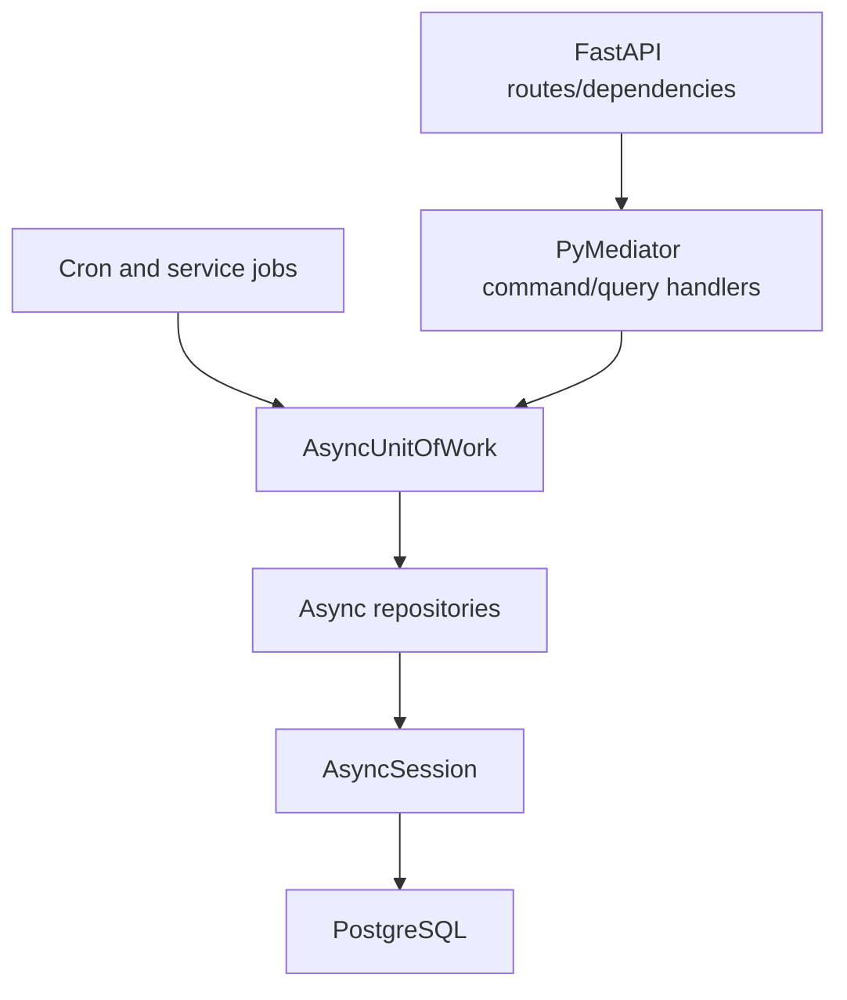

# Async Repository Consolidation

## Overview

Move MealTrack backend to an async-only database runtime. The plan follows the approved Approach B from the brainstorm report: migrate consumers first, convert risky repositories behind tests, then delete sync runtime after static guards prove no consumers remain.

Expected output: implementation-ready plan, phase files, research reports, and red-team review for consolidating all repository/UoW/session usage to async.

## Scope Challenge

- User explicitly chose full scope: all repositories, remove sync end-state, all acceptance criteria, include pgvector/pending/food/translation hot spots.
- Minimum safe implementation is still phased. Big bang deletion is high risk because sync DB config owns `Base`, tests patch `ScopedSession`, and some repositories commit internally.
- Selected mode: hard planning. Research and red-team are included.

## Requirements

Acceptance criteria:

- No sync DB work remains in FastAPI request paths.
- No repository calls `commit()` or `rollback()` internally except dependency cleanup or explicitly tested cache recovery boundaries.
- Repository ports used by application code are async-shaped.
- Cron jobs, services, health checks, route dependencies, and tests use async DB access.
- Sync `UnitOfWork`, sync repositories, runtime sync DB config, and async wrappers around sync repositories are removed.
- Existing API behavior remains backward compatible.
- Tests, lint, type checks, and import-boundary checks pass.

Out of scope:

- Schema redesign beyond config/Base relocation if needed.
- New product features.
- API response shape changes.
- Read-model creation.
- Non-DB cache redesign beyond async DB-backed cache repositories.

## Architecture Direction

Target flow:

Rules:

- `AsyncUnitOfWork` owns transaction boundaries.
- Repositories may `flush()` when they need generated IDs or relationship state.
- Repositories do not commit.
- Runtime code does not import sync `SessionLocal`, `ScopedSession`, sync `get_db`, or sync repositories.
- Alembic/migration needs are isolated from runtime needs.

## Research Inputs

- [Runtime touchpoints research](./research/runtime-touchpoints-research.md)
- [Repository transaction research](./research/repository-transaction-research.md)
- [Red-team review](./reports/red-team-review.md)
- [Brainstorm report](../reports/260609-1442-async-repository-consolidation-brainstorm.md)

## Cross-Plan Dependencies

No unfinished local plan blocks this work. Existing Redis cache and normalized database refactor plans are completed.

## Phases

| Phase | Name | Status |
|-------|------|--------|
| 1 | [Inventory, guardrails, and Base split](./phase-01-inventory-guardrails-and-base-split.md) | Completed |
| 2 | [Async ports and Unit of Work contracts](./phase-02-async-ports-and-uow-contracts.md) | Completed |
| 3 | [Request path dependency migration](./phase-03-request-path-dependency-migration.md) | Completed |
| 4 | [Core repository family consolidation](./phase-04-core-repository-family-consolidation.md) | Completed |
| 5 | [Sync-only hot repository conversion](./phase-05-sync-only-hot-repository-conversion.md) | Completed |
| 6 | [Cron service and operational path migration](./phase-06-cron-service-and-operational-path-migration.md) | Completed |
| 7 | [Async test fixture migration](./phase-07-async-test-fixture-migration.md) | Completed |
| 8 | [Sync runtime deletion and release validation](./phase-08-sync-runtime-deletion-and-release-validation.md) | Completed |

## Validation Plan

Static checks:

- `rg "from src.infra.database.config import|SessionLocal|ScopedSession|UnitOfWork\\(" src tests`
- `rg "\\.commit\\(|\\.rollback\\(" src/infra/repositories src/infra/database`
- `ruff check src tests`
- `mypy src`
- `lint-imports`

Targeted tests:

- async UoW tests
- async repository integration tests
- manual meal command tests
- image upload command tests
- food reference repository tests
- pgvector meal image cache tests, including failure recovery
- pending meal image queue tests
- notification/email cron tests
- route tests for meals, suggestions, ingredients, feature flags, and health

Full checks:

- `pytest`
- `pytest --cov=src --cov-report=term`

## Risks

- Moving `Base` incorrectly can break all model imports and Alembic.
- Removing internal commits changes write timing.
- Pgvector cache failure recovery can regress into transaction poisoning.
- Tests can pass through wrappers while runtime remains sync.
- Alembic may need a migration-only sync path longer than runtime code does.

## Boundary Reminder

This plan is design only. Implementation should start from phase 1 and should not delete sync runtime until guard tests and static searches prove consumers are gone.

## Unresolved Questions

None.
