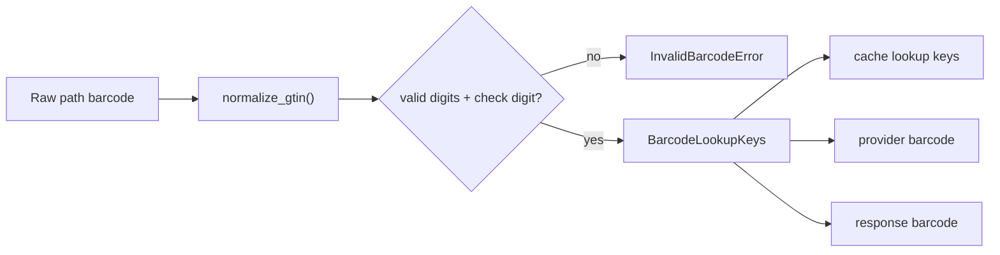

# Phase 1: Current Contract Baseline and GTIN Normalization

## Context Links

- Handler: `src/app/handlers/query_handlers/lookup_barcode_query_handler.py`
- Query: `src/app/queries/food/lookup_barcode_query.py`
- API route: `src/api/routes/v1/foods.py`
- Response schema: `src/api/schemas/response/barcode_product_response.py`
- Tests: `tests/unit/handlers/query_handlers/test_lookup_barcode_query_handler_async.py`
- GS1 check digit reference: https://www.gs1us.org/tools/check-digit-calculator
- GS1 prefix warning: https://support.gs1.org/support/solutions/articles/43000734188-does-the-gs1-prefix-first-3-or-4-digits-of-the-ean-13-barcode-number-show-the-country-of-origin-

## Overview

Create a tested barcode normalization boundary before the cascade. The goal is to prevent duplicate lookups/cache rows, reject invalid symbols early, and remove the misleading "country of origin" assumption from AI fallback prompts.

## Key Insights

- Current handler accepts raw path text and passes it to cache, FatSecret, OpenFoodFacts, Brave, and AI.
- FatSecret already zero-fills to 13 digits internally, but cache and other providers do not share that canonicalization.
- `_get_country_from_barcode()` treats GS1 prefix allocation as origin, which GS1 explicitly says is not reliable.
- `BarcodeProductResponse.barcode` is required, so every successful path must preserve the scanned or canonical barcode.
- Current cache lookup and upsert use one raw `barcode` column. Alias lookup only prevents duplicates if cache writes use one canonical storage form.
- Invalid barcode handling must be translated at the API boundary. The handler/application layer should raise or receive domain data, not import FastAPI `HTTPException`.
- Current handler and Brave adapter logs include raw barcode values. Redaction or hashing must happen before adding more miss telemetry.

## Requirements

- Functional: support GTIN-8, GTIN-12, GTIN-13, and GTIN-14 input formats made of digits.
- Functional: validate check digits before external provider calls.
- Functional: produce canonical lookup keys so UPC-A/EAN-13 cache lookup can find the same product where possible.
- Functional: return `400 Invalid barcode` from the route for malformed input or failed check digit; valid GTIN not found remains 404.
- Functional: store cached barcode rows under canonical GTIN-14 while preserving the scanned barcode in the response.
- Non-functional: no network calls for invalid input.
- Non-functional: pure normalization code, easy to unit test.
- Non-functional: no raw full barcode values in logs; use fixed-length hash, suffix-only redaction, or low-cardinality metadata.

## Architecture



Recommended helper shape:

```python
@dataclass(frozen=True)
class BarcodeLookupKeys:
    raw: str
    gtin: str
    gtin_13: str | None
    gtin_14: str | None
    aliases: tuple[str, ...]
```

Keep this in domain/application-level code, not infra, because validation is business input hygiene and has no external dependency. Route code should normalize once, pass the resulting keys into `LookupBarcodeQuery`, and translate `InvalidBarcodeError` to HTTP 400.

Storage and response policy:

- `food_reference.barcode`: canonical `gtin_14`.
- Provider calls: deterministic alias order from `BarcodeLookupKeys.aliases`.
- `BarcodeProductResponse.barcode`: scanned `raw` value unless the client accepts optional canonical metadata later.
- Existing noncanonical rows: read via aliases, but future writes use canonical `gtin_14`; do not destructively merge old rows in this phase.

## Related Code Files

- Create: `src/domain/services/barcode/gtin_normalizer.py`
- Create: `src/domain/services/barcode/__init__.py`
- Create: `src/domain/exceptions/barcode_exceptions.py`
- Modify: `src/app/handlers/query_handlers/lookup_barcode_query_handler.py`
- Modify: `src/app/queries/food/lookup_barcode_query.py`
- Modify: `src/api/routes/v1/foods.py`
- Modify: `src/api/schemas/response/barcode_product_response.py` only if optional metadata is accepted.
- Modify: `tests/unit/handlers/query_handlers/test_lookup_barcode_query_handler_async.py`
- Modify: `tests/unit/api/test_small_v1_routers.py`
- Create: `tests/unit/domain/services/barcode/test_gtin_normalizer.py`

## Implementation Steps

1. Add tests for GTIN check digit validation and alias generation before changing the handler.
2. Implement `gtin_normalizer.py` with digit-only validation, check digit calculation, and aliases.
3. Add `InvalidBarcodeError` in domain exceptions and keep it free of HTTP concepts.
4. Update the API route to normalize before `event_bus.send()` and map invalid input to `HTTPException(400, "Invalid barcode")`.
5. Extend `LookupBarcodeQuery` to carry canonical barcode, scanned barcode, and aliases instead of only raw path text.
6. Update cache lookups to try aliases in deterministic order and select the highest-trust row when multiple aliases already exist.
7. Force all cache writes to use canonical `gtin_14`; response payload should set `barcode` back to the scanned value.
8. Replace `_get_country_from_barcode()` use in AI estimate prompt with `gs1_prefix_hint` or remove it.
9. Add a small barcode log formatter and replace raw barcode logging in the handler and Brave adapter.
10. Add tests proving invalid input does not call FatSecret/OpenFoodFacts/USDA/Brave/AI.
11. Add tests proving UPC-A and zero-prefixed EAN-13 hit the same cached row and do not create a duplicate write.

## Todo List

- [x] Add GTIN normalizer unit tests.
- [x] Add invalid barcode route/handler tests.
- [x] Implement normalizer and exception.
- [x] Wire normalizer into barcode route and query contract.
- [x] Canonicalize cache writes to GTIN-14.
- [x] Redact barcode logs.
- [x] Replace GS1 prefix origin language.

## Success Criteria

- [x] GTIN helper validates known-good and known-bad GTIN-8/12/13/14 examples.
- [x] Invalid barcode returns 400; valid GTIN miss still returns 404.
- [x] External providers are not called for invalid barcode input.
- [x] Canonical cache writes use GTIN-14, while API responses preserve the scanned barcode.
- [x] Existing FatSecret and cache tests still pass.
- [x] No code comments or names claim GS1 prefix equals country of origin.
- [x] Handler and Brave logs do not contain the full raw barcode.

## Risk Assessment

- Risk: rejecting barcodes the mobile scanner currently sends with spaces or hyphens.
  Mitigation: strip common separators if mobile can produce them; still reject letters.
- Risk: cache aliases could produce duplicate upserts.
  Mitigation: only upsert canonical GTIN-14, and tests must assert one cache write.
- Risk: changing invalid barcode from 404 to 400 may affect mobile.
  Mitigation: confirm client handling before implementation; if mobile cannot tolerate 400, revise this plan before cooking.
- Risk: existing noncanonical alias rows can still be present.
  Mitigation: read aliases, choose verified/highest-confidence row, and leave destructive merge/backfill to a separate data-maintenance task.

## Security Considerations

- Treat barcode as untrusted path input.
- Do not log raw barcode input beyond safe length-limited metadata.
- Avoid external calls on invalid input to protect provider quotas.

## Next Steps

- Phase 2 can depend on normalized keys for exact `gtinUpc` matching in USDA FDC.
