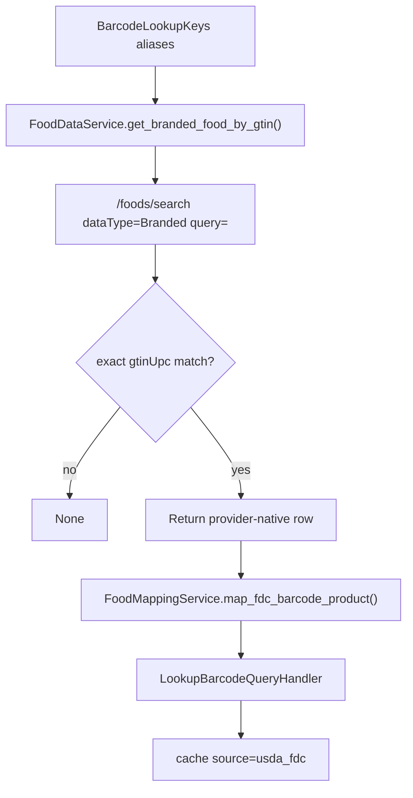

# Phase 2: USDA FDC Branded Provider

## Context Links

- Existing USDA client: `src/infra/adapters/food_data_service.py`
- Existing port: `src/domain/ports/food_data_service_port.py`
- Settings: `src/infra/config/settings.py`
- Barcode handler: `src/app/handlers/query_handlers/lookup_barcode_query_handler.py`
- Food reference projection: `src/infra/repositories/food_reference_projection.py`
- USDA API guide: https://fdc.nal.usda.gov/api-guide

## Overview

Add a structured USDA FoodData Central branded-food fallback for exact GTIN/UPC matches. This fills a real gap between OpenFoodFacts misses and web-search guesses, especially for US packaged foods.

## Key Insights

- `FoodDataService` already exists, is async, and reads `USDA_FDC_API_KEY`.
- `FoodDataServicePort` is documented as returning provider-native payloads; mapping belongs in `FoodMappingService` / `FoodMappingServicePort`.
- The current food route uses USDA search/details for `/v1/foods/search` and `/v1/foods/{fdc_id}/details`, but barcode lookup does not use USDA.
- USDA branded foods can expose `gtinUpc`, brand owner, ingredients, serving size, and nutrients.
- KISS: extend the existing `FoodDataService` instead of adding a new adapter family.
- `FoodDataService._get()` raises on HTTP errors today, so the FDC barcode step needs an explicit exception boundary before it can be a safe fallback.
- Existing USDA mapping returns nested search/detail shapes, not the flat `*_100g` barcode response shape.
- `food_reference.is_verified` exists, but `AsyncFoodReferenceRepository.upsert()` currently ignores the field for barcode upserts.
- Current USDA nutrient mapping lacks fiber and sugar IDs needed by the barcode response defaults.

## Requirements

- Functional: search FDC Branded foods for normalized GTIN/UPC aliases.
- Functional: accept only exact normalized `gtinUpc` matches.
- Functional: return provider-native exact FDC rows from `FoodDataService`, then map FDC nutrients to existing per-100g fields through the mapping layer.
- Functional: derive calories from macros, not from FDC reported calories.
- Functional: persist `is_verified=true` for exact FDC GTIN matches and do not downgrade verified rows with unverified later writes.
- Functional: map FDC barcode results to flat `BarcodeProductResponse`/handler keys, including `protein_100g`, `carbs_100g`, `fat_100g`, `fiber_100g`, and `sugar_100g`.
- Non-functional: if USDA key is missing or USDA fails, catch the expected error and degrade to the next cascade step.
- Non-functional: no raw USDA payload logging.

## Architecture

The barcode mapper must return the same flat shape consumed by `_has_nutrition()` and `BarcodeProductResponse`. Do not reuse `map_search_item()` or `map_food_details()` directly unless they delegate to a flat barcode mapper.

## Related Code Files

- Modify: `src/infra/adapters/food_data_service.py`
- Modify: `src/domain/ports/food_data_service_port.py`
- Modify: `src/domain/services/food_mapping_service.py`
- Modify: `src/domain/ports/food_mapping_service_port.py` if a new mapper method is added.
- Modify: `src/api/dependencies/event_bus.py`
- Modify: `src/app/handlers/query_handlers/lookup_barcode_query_handler.py`
- Modify: `src/api/schemas/response/barcode_product_response.py` to include `usda_fdc` in source docs.
- Modify: `src/infra/repositories/food_reference_repository_async.py`
- Create or modify: `tests/unit/infra/adapters/test_food_data_service.py`
- Create or modify: `tests/unit/domain/services/test_food_mapping_service.py`
- Modify: `tests/unit/infra/repositories/test_food_reference_repository_async.py`
- Modify: `tests/integration/api/conftest.py` because `MockFoodDataService` implements `FoodDataServicePort`.
- Modify: `tests/unit/infra/test_food_database.py` or any local food-data test doubles affected by a new port method.
- Modify: `tests/unit/handlers/query_handlers/test_lookup_barcode_query_handler_async.py`
- Modify: `tests/unit/api/test_event_bus_dependency_singletons.py`
- Modify: `docs/external-services.md`

## Implementation Steps

1. Add unit tests for USDA branded search mapping with a realistic minimal FDC response.
2. Extend `FoodDataServicePort` with `get_branded_food_by_gtin(gtin_aliases: list[str]) -> dict | None`.
3. Update the known `FoodDataServicePort` implementers:
   - `src/infra/adapters/food_data_service.py`
   - `tests/integration/api/conftest.py`
4. Implement the method in `FoodDataService` using `/foods/search` with `dataType=Branded` and `pageSize` capped low.
5. Catch expected USDA config/HTTP/JSON errors in the service method or the handler FDC step, record `usda_fdc_error`, and return `None` so Brave/AI can continue.
6. Normalize candidate `gtinUpc` values before exact comparison.
7. Add `FoodMappingService.map_fdc_barcode_product()` as a concrete helper first. Only add it to `FoodMappingServicePort` if another consumer needs the port method; if public, enumerate all port implementers and tests with `rg FoodMappingServicePort|get_food_mapping_service|map_`.
8. Map fields:
   - `name`: `description` or `lowercaseDescription`
   - `brand`: `brandOwner` or `brandName`
   - `barcode`: matched normalized GTIN/UPC
   - `fdc_id`: `fdcId`
   - macros: nutrient IDs/names from `foodNutrients` into flat `*_100g` fields
   - fiber: nutrient ID `1079` / fiber name fallback
   - sugar: nutrient ID `2000` / sugars name fallback
   - `serving_size`: amount + unit when present
   - `source`: `usda_fdc`
   - `is_verified`: true for exact GTIN match
9. Do not copy FDC nutrient 1008 as authoritative calories; any internal calories must be derived from mapped macros with the backend formula.
10. Update barcode `food_reference` upsert to persist `is_verified` and protect verified rows from later unverified overwrites.
11. Inject `food_data_service` and `food_mapping_service` into `LookupBarcodeQueryHandler` from `get_food_search_event_bus()`. Constructor contract must be explicit:
    - If required, update both current call sites: `src/api/dependencies/event_bus.py` and `tests/unit/handlers/query_handlers/test_lookup_barcode_query_handler_async.py`.
    - If optional, add tests proving production wiring supplies both and FDC is skipped only when absent.
12. Add cascade step after OpenFoodFacts and before Brave.
13. Cache exact FDC hits into `food_reference` using canonical GTIN-14 from Phase 1.
14. Add a backend source-contract test for `usda_fdc` and list downstream/mobile source-string coordination in docs.
15. Update docs and source description strings.

## Todo List

- [x] Add FDC mapping fixture/tests.
- [x] Extend port and client.
- [x] Extend mapper or add mapper helper.
- [x] Add FDC exception/fallback test.
- [x] Persist and protect `is_verified` in barcode upsert.
- [x] Update FoodDataServicePort test doubles.
- [x] Wire handler dependency.
- [x] Update singleton event bus dependency tests.
- [x] Insert FDC cascade step.
- [x] Update docs.

## Success Criteria

- [x] FDC exact `gtinUpc` match returns source `usda_fdc`.
- [x] Non-exact FDC search results are ignored.
- [x] Missing USDA key or HTTP failure falls through to Brave/AI without 500.
- [x] FDC hit is cached once to `food_reference`.
- [x] Cached FDC hit later reads back with `is_verified=true`.
- [x] FDC mapper returns flat barcode `*_100g` fields, including fiber and sugar defaults.
- [x] Calories remain backend-derived from macros.

## Risk Assessment

- Risk: FDC nutrient names vary.
  Mitigation: map by nutrient ID where possible, name fallback where necessary, and test both.
- Risk: FDC search returns stale or reformulated products.
  Mitigation: only exact GTIN/UPC matches count; keep source metadata.
- Risk: more external latency.
  Mitigation: cap page size, set timeout, and place after higher-confidence existing providers.
- Risk: adding abstract methods breaks test doubles.
  Mitigation: enumerate implementers before editing ports and keep barcode-only mapping concrete unless a second consumer needs the port method.
- Risk: source string `usda_fdc` surprises clients.
  Mitigation: document it as an API contract and coordinate mobile/analytics before rollout.

## Security Considerations

- Never expose USDA API key.
- Avoid logging FDC raw response or full search payload.
- Keep HTTP timeout bounded.

## Next Steps

- Phase 3 will integrate this provider into the confidence policy and demote Brave nutrition.
