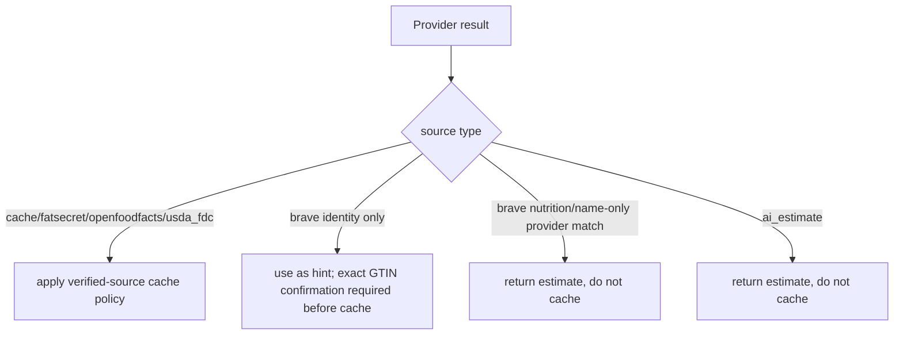

# Phase 3: Cascade Confidence and Brave Demotion

## Context Links

- Handler: `src/app/handlers/query_handlers/lookup_barcode_query_handler.py`
- Brave adapter: `src/infra/adapters/brave_search_nutrition_service.py`
- Prompts: `src/domain/services/prompts/system_prompts.py`
- AI routing: `src/infra/adapters/meal_generation_service.py`
- Tests: `tests/unit/infra/adapters/test_brave_search_nutrition_service.py`

## Overview

Make the cascade explicit about source confidence. Structured provider hits can be cached and returned as product data. Web/LLM output should be treated as a candidate identity or an editable estimate, not as trusted catalog truth.

## Key Insights

- Current handler caches Brave estimates if they have positive macros.
- Current Brave adapter passes `protein_100g` / `carbs_100g` / `fat_100g` payloads into `MacroValidationService`, but that service reads `protein` / `carbs` / `fat`. This can produce misleading derived `calories` metadata unless adapted or bypassed for per-100g barcode shape.
- `MacroValidationService` is meal-oriented and floors fat at 3g. It must not be reused for per-100g barcode facts or estimates.
- Brave snippets often fail to clearly identify a barcode product.
- Cloudflare text models are configured for barcode; strict JSON contracts still need adapter-level negative-result handling.
- The public response already has `source` and `is_estimate`, which are enough for a first reliability pass.
- Current cache reads overwrite the persisted provider source with `source="cache"`, hiding old `brave_search` rows from source-policy checks.
- Current Brave name verification can cache a FatSecret name-search result under the scanned barcode even when no provider confirms that GTIN.

## Requirements

- Functional: define one source policy in code and tests.
- Functional: Brave+AI product identity can improve the user-facing estimate, but name-only matches must not create verified `food_reference` rows.
- Functional: Brave-derived candidates can only be cached when a structured provider confirms the same GTIN/barcode.
- Functional: Brave-only nutrition must be marked `is_estimate=true` and should not be cached as verified food data.
- Functional: per-100g barcode macro validation must use barcode-specific logic with no meal fat floor.
- Functional: malformed JSON with braces remains a provider failure; plain uncertainty becomes a miss.
- Functional: cache hits must preserve or expose persisted provider provenance and skip untrusted cached rows.
- Non-functional: preserve current response shape unless optional metadata is backwards compatible.

## Architecture

Source policy:

- `fatsecret`, `openfoodfacts`, `usda_fdc` exact barcode/GTIN hits: cache as verified external rows.
- `cache`: return only if persisted row is verified or persisted source is still an allowed structured source; skip persisted `brave_search` / `ai_estimate` rows unless product explicitly accepts legacy data.
- `brave_search`: identity and estimate hint only; never write to canonical `food_reference` unless exact GTIN is verified by a structured provider.
- `fatsecret` name search after Brave: can produce an editable estimate, but is not a verified barcode product unless the provider result includes the scanned/canonical barcode.
- `ai_estimate`: editable, uncached.

## Related Code Files

- Modify: `src/app/handlers/query_handlers/lookup_barcode_query_handler.py`
- Modify: `src/infra/adapters/brave_search_nutrition_service.py`
- Modify: `src/domain/services/prompts/system_prompts.py`
- Create: `src/domain/services/barcode/barcode_nutrition_validator.py` or equivalent local helper.
- Modify: `tests/unit/handlers/query_handlers/test_lookup_barcode_query_handler_async.py`
- Modify: `tests/unit/infra/adapters/test_brave_search_nutrition_service.py`
- Modify: `docs/api-endpoints.md`

## Implementation Steps

1. Add tests that pin the desired source policy:
   - FDC exact hit caches.
   - Brave prose miss falls through.
   - Brave candidate name triggers FatSecret name lookup only as an estimate path unless exact barcode is confirmed.
   - Brave-only macros return `is_estimate=true`.
   - AI estimate returns uncached.
   - Cached rows with persisted `source="brave_search"` are skipped or returned only as estimates, not trusted cache hits.
2. Extract small helpers inside the handler if needed:
   - `_record_miss(reason)`
   - `_mark_estimate(result, source)`
   - `_cache_if_verified(result)`
   - `_is_trusted_cached_row(result)`
3. Adjust Brave adapter contract:
   - accepted success: dict with name and macros
   - accepted miss: `None` or literal JSON `null`
   - contract failure: malformed JSON object
4. Update `BARCODE_BRAVE_EXTRACT` prompt to say identity confidence matters and prose is forbidden.
5. Remove OpenFoodFacts name-search claims from this plan; the current adapter only supports barcode lookup.
6. Do not add FDC name verification in this phase unless Phase 2 explicitly added a name-search contract. Exact `gtinUpc` remains the FDC contract for this plan.
7. Disable all `brave_search` cache writes. Name-only FatSecret results from Brave hints must be marked `is_estimate=true` and remain uncached unless exact barcode is confirmed.
8. Add a barcode-specific nutrition validator that clamps negative `*_100g` values, derives any internal calorie value from flat macros, and never applies the meal-level 3g fat floor.
9. Add a test proving `MacroValidationService` is not directly applied to `*_100g` barcode payloads.
10. Preserve provenance for cache hits:
    - Keep `source="cache"` only if optional `provider_source` or equivalent metadata is added.
    - Or return the persisted provider source directly and document the contract change.
    - In either case, old `brave_search` cached rows must not be treated as verified.
11. Add source/confidence log fields without raw barcodes, raw snippets, or AI output.

## Todo List

- [x] Add branch tests for Brave miss/candidate/estimate.
- [x] Add source confidence helpers.
- [x] Demote Brave-only nutrition from verified cache behavior.
- [x] Stop name-only Brave/FatSecret results from writing to cache.
- [x] Fix barcode validation with a no-fat-floor `*_100g` validator.
- [x] Preserve cache provenance and skip untrusted legacy cached rows.
- [x] Update prompt and adapter contract tests.
- [x] Update API docs for source semantics.

## Success Criteria

- [x] No Brave uncertainty path emits `[JSON-EXTRACT-FAILED]`.
- [x] Brave-only estimates do not create verified `food_reference` rows.
- [x] Brave-derived name-only provider matches are uncached estimates.
- [x] Verified external sources still cache.
- [x] Cache hits cannot hide persisted untrusted provider sources.
- [x] Source values and optional provenance metadata are deterministic and documented.
- [x] Barcode handler tests cover every cascade branch affected by this phase.

## Risk Assessment

- Risk: demoting Brave lowers hit rate.
  Mitigation: AI estimate still returns editable data; not-found telemetry measures impact.
- Risk: handler becomes too large.
  Mitigation: extract only local private helpers first; create services only if tests show real duplication.
- Risk: source behavior ambiguity leaks to mobile.
  Mitigation: keep `source` and `is_estimate` stable; coordinate any new metadata separately.
- Risk: old cached Brave rows continue to win before the new policy.
  Mitigation: skip persisted untrusted cache rows in code and track how often this happens before any destructive cleanup.

## Security Considerations

- Web snippets may contain arbitrary text. Never log raw snippets or place them directly in cache.
- Do not allow LLM output to set trusted flags.
- Keep user-visible product data separated from internal miss reasons.
- Name-only structured-provider matches from Brave hints are not proof of barcode identity.

## Next Steps

- Phase 4 uses source/miss reasons for rollout metrics and missing-product decisions.
