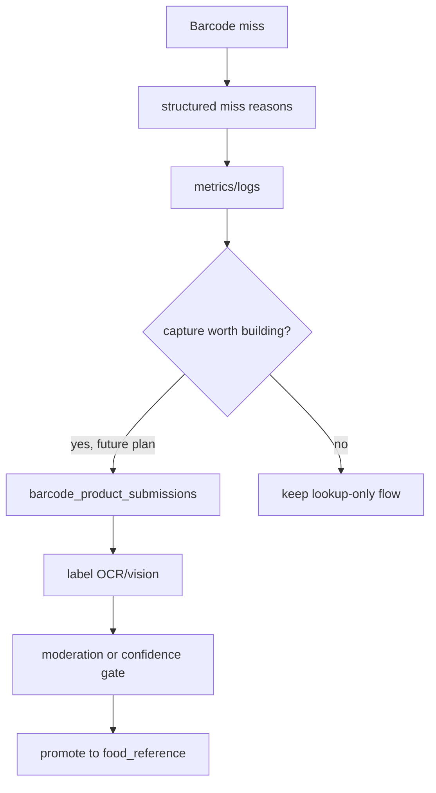

# Phase 4: Missing Product Capture and Rollout

## Context Links

- Barcode route: `src/api/routes/v1/foods.py`
- Barcode handler logs: `src/app/handlers/query_handlers/lookup_barcode_query_handler.py`
- Brave adapter logs: `src/infra/adapters/brave_search_nutrition_service.py`
- Food reference model: `src/infra/database/models/food_reference_model.py`
- External services docs: `docs/external-services.md`
- API docs: `docs/api-endpoints.md`

## Overview

Add the observability and rollout guardrails needed before building full user-contributed barcode capture. The plan intentionally does not write unverified user submissions into `food_reference`; that would poison the global catalog without moderation.

## Key Insights

- `food_reference.is_verified` exists, but the table is global catalog state, not per-user draft storage.
- A real missing-product capture flow needs mobile UX, image storage, OCR/vision, moderation, and product reformulation handling.
- The safe backend first step is telemetry plus documented API behavior.
- Current barcode logs include raw barcode values. Rollout telemetry must fix hot-path logging before adding more counters.
- Source provenance matters for rollout: a `cache` hit backed by an old `brave_search` row should not count as a trusted structured-provider hit.

## Requirements

- Functional: log low-cardinality miss reasons for barcode lookup.
- Functional: expose enough internal metrics to decide whether user capture is worth building.
- Functional: document the recommended future user-draft flow without implementing unsafe global writes.
- Functional: record source/provenance metrics that distinguish verified cache hits from skipped untrusted cached rows.
- Non-functional: do not add a new table unless implementation proceeds beyond telemetry.
- Non-functional: no raw full barcodes, raw provider payloads, raw AI output, or label images in logs.

## Architecture



Future capture should use a separate submission table, not direct `food_reference` writes:

```text
barcode_product_submissions
- id
- user_id
- barcode
- product_name
- brand
- nutrition_label_image_url
- front_image_url
- extracted_payload
- status: pending|accepted|rejected
- created_at
```

## Related Code Files

- Modify: `src/app/handlers/query_handlers/lookup_barcode_query_handler.py`
- Modify: `docs/api-endpoints.md`
- Modify: `docs/external-services.md`
- Create or modify: `plans/reports/...` only if rollout metrics need a separate report.
- No DB migration in this phase unless the team explicitly approves user-submission capture.

## Implementation Steps

1. Add tests or log assertions for miss reason behavior where practical.
2. Replace hot-path raw barcode logging with a safe formatter from Phase 1 before adding metrics.
3. Standardize miss reasons:
   - `invalid_barcode`
   - `cache_empty`
   - `cache_untrusted_source`
   - `fatsecret_empty`
   - `openfoodfacts_empty`
   - `usda_fdc_empty`
   - `usda_fdc_error`
   - `brave_empty`
   - `ai_estimate_empty`
4. Add low-cardinality observability counters if the repo's observability facade supports it.
5. Update docs with target source order, source semantics, optional provenance metadata, and rollout flag/env requirements.
6. Add a short "future missing product capture" section that requires a separate submission table and moderation gate.
7. Define rollout checks:
   - hit rate by source
   - hit rate by original provider source/provenance when available
   - not-found rate
   - AI estimate rate
   - provider latency
   - parse/contract failure rate
   - skipped untrusted cache rows
8. Run focused tests and a route-level smoke test.

## Todo List

- [x] Standardize miss reasons.
- [x] Redact raw barcode logs.
- [x] Add safe metrics/logging.
- [x] Update docs.
- [x] Document future submission table.
- [x] Define rollout dashboard checks.

## Success Criteria

- [x] Barcode misses include safe, low-cardinality reason metadata.
- [x] Logs and metrics do not contain the full raw barcode.
- [x] Rollout metrics distinguish verified cache hits from skipped untrusted cache rows.
- [x] Docs explain source ordering and estimate semantics.
- [x] No unverified user submission is written to canonical `food_reference`.
- [x] Rollout metrics are sufficient to decide whether to build label-photo capture later.
- [x] All focused barcode tests pass.

## Risk Assessment

- Risk: metrics add noise or high-cardinality labels.
  Mitigation: never use raw barcode as a metric label or full log value; use source, provenance, and reason only.
- Risk: future capture is overbuilt too early.
  Mitigation: this phase documents it but keeps implementation out until hit-rate data justifies it.
- Risk: product team expects mobile capture immediately.
  Mitigation: call it out as a separate cross-client plan.

## Security Considerations

- Barcode values may be user input; do not put raw values in metric labels.
- Do not log full raw barcode values; if correlation is needed, use a fixed-length hash or suffix-only redaction.
- Label photos can contain PII in edge cases; future upload flow must use normal image privacy rules.
- Moderation is required before promoting user submissions to global catalog.

## Next Steps

- If miss rate remains high after FDC fallback, create a separate cross-repo plan for mobile label-photo capture and backend submission moderation.
