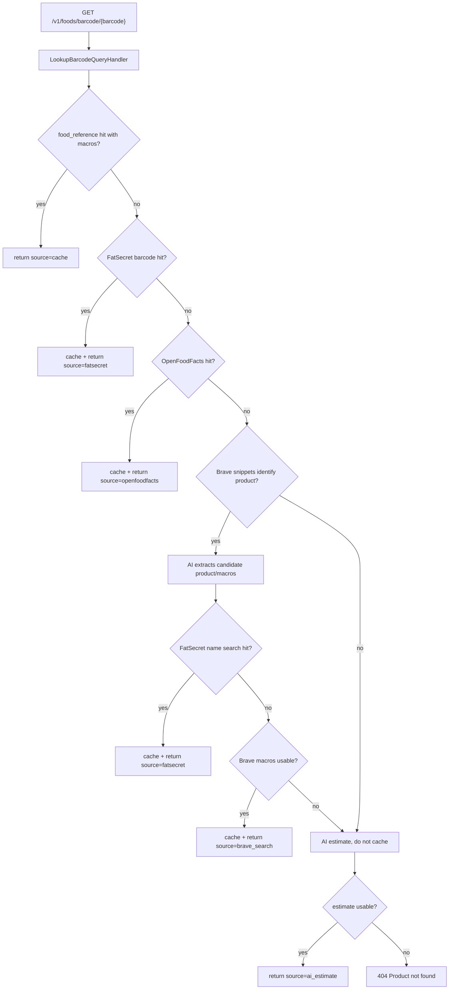
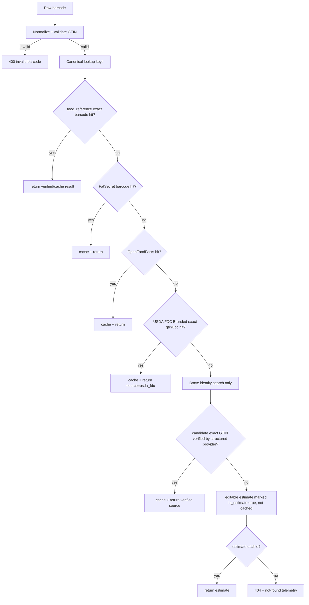

# Barcode GTIN Source Reliability

## Overview

MealTrack already has a barcode cascade, but misses and ambiguous web snippets still push too much responsibility onto LLM estimation. This plan makes the barcode path more deterministic: validate and normalize GTINs, stop using GS1 prefixes as country-of-origin truth, add USDA FoodData Central branded foods as a structured source, and make Brave/LLM results identity hints rather than nutrition truth unless verified.

Current runtime flow from code:

Target flow:

## Scope

In scope:
- Backend barcode lookup only.
- GTIN validation and canonical lookup keys for UPC/EAN/GTIN forms.
- USDA FoodData Central branded-food exact-match fallback.
- Source confidence policy for `cache`, `fatsecret`, `openfoodfacts`, `usda_fdc`, `brave_search`, and `ai_estimate`.
- Missing-product telemetry and a safe backend contract recommendation.

Out of scope for this plan:
- Mobile scanner UX changes.
- OCR/vision label upload implementation.
- Direct writes of unverified user submissions into canonical `food_reference`.
- GS1 paid registry integration unless a separate business decision approves it.

## Key Decisions

- Use `food_reference` as the cache/catalog for verified external provider hits, matching the current schema.
- Do not trust GS1 prefix as country of origin. Use it only as a weak prefix allocation hint or remove it from AI prompts.
- Add USDA FDC by extending the existing `FoodDataService` rather than creating another provider abstraction.
- Treat Brave as candidate identity discovery. Nutrition returned only from Brave+AI should remain estimated and should not outrank structured providers.
- Treat name-only Brave/FatSecret matches as editable estimates, not verified barcode catalog rows.
- Store barcode cache rows under canonical GTIN-14 and keep the scanned barcode as response-facing data.
- Preserve verified/provenance state in `food_reference`; cache hits must not hide persisted untrusted sources.
- Keep the public success response shape backward compatible. Add optional metadata only if clients tolerate it.

## Phases

| Phase | Name | Status |
|-------|------|--------|
| 1 | [Current Contract Baseline and GTIN Normalization](./phase-01-current-contract-baseline-and-gtin-normalization.md) | Completed |
| 2 | [USDA FDC Branded Provider](./phase-02-usda-fdc-branded-provider.md) | Completed |
| 3 | [Cascade Confidence and Brave Demotion](./phase-03-cascade-confidence-and-brave-demotion.md) | Completed |
| 4 | [Missing Product Capture and Rollout](./phase-04-missing-product-capture-and-rollout.md) | Completed |

## Dependencies

- No blocking project plan found. Older food-reference and LLM output contract plans are completed.
- Requires `USDA_FDC_API_KEY`, already present in settings.
- External references:
  - GS1 GTIN overview: https://www.gs1us.org/upcs-barcodes-prefixes/what-is-a-gtin
  - GS1 check digit calculator: https://www.gs1us.org/tools/check-digit-calculator
  - GS1 prefix is not origin: https://support.gs1.org/support/solutions/articles/43000734188-does-the-gs1-prefix-first-3-or-4-digits-of-the-ean-13-barcode-number-show-the-country-of-origin-
  - OpenFoodFacts API: https://openfoodfacts.github.io/openfoodfacts-server/api/
  - FatSecret barcode API: https://platform.fatsecret.com/docs/v2/food.find_id_for_barcode
  - USDA FoodData Central API: https://fdc.nal.usda.gov/api-guide

## Success Criteria

- Invalid barcodes fail before external calls with a clear API error.
- UPC/EAN/GTIN variants normalize to stable lookup keys and do not create duplicate cache rows.
- FDC exact GTIN/UPC hits fill barcode misses without LLM involvement.
- Brave/LLM uncertainty no longer creates parse failures or cache pollution.
- Name-only web-search matches do not write to the global catalog.
- Verified cache state survives upsert/readback.
- Existing untrusted cached Brave rows do not count as trusted cache hits.
- Barcode per-100g macros are validated with `*_100g`-aware logic, not meal-level macro keys.
- Barcode logs and metrics do not contain full raw barcode values.
- AI estimates remain editable, visibly estimated, and uncached.
- Focused unit tests cover cache, FatSecret, OpenFoodFacts, FDC, Brave miss, Brave candidate, AI estimate, invalid barcode, and source metadata.

## Implementation Notes

- Prefer small pure helpers for GTIN normalization and nutrient mapping.
- Keep provider-native USDA calls in `FoodDataService`; put barcode-response mapping in the existing mapping layer.
- Keep all provider failures degradable to the next cascade step unless the barcode itself is invalid.
- Keep raw external payloads and raw AI output out of logs.
- Keep raw full barcode values out of logs; use redacted or hashed correlation only.
- Preserve "calories derived from macros" across all mapped results.

## Validation Log

### Verification Results

- **Tier:** Standard
- **Claims checked:** 34
- **Verified:** 31 | **Failed:** 3 | **Unverified:** 0
- **CLI structure check:** `ck plan validate ... --strict` passed with 0 errors, 0 warnings.

#### Failures Found and Resolved

1. [Contract Verifier] `FoodDataServicePort` extension affects existing implementers beyond production `FoodDataService`.
   Evidence: `tests/integration/api/conftest.py` defines `MockFoodDataService(FoodDataServicePort)`, and `src/infra/adapters/food_data_service.py` implements `FoodDataServicePort`.
   Resolution: Phase 2 now requires updating test doubles and lists the integration fixture.
2. [Contract Verifier] Phase 2 originally put provider-to-barcode mapping inside `FoodDataService`, but the port documents provider-native payloads and `FoodMappingServicePort` owns transformation.
   Evidence: `src/domain/ports/food_data_service_port.py` says provider-native payloads are transformed by a separate mapping layer; `src/domain/ports/food_mapping_service_port.py` owns field mapping.
   Resolution: Phase 2 now returns provider-native FDC rows and maps barcode response fields through the mapping layer.
3. [Fact Checker] Brave barcode extraction uses `*_100g` keys while `MacroValidationService.validate_and_correct()` reads meal-level `protein`, `carbs`, `fat`.
   Evidence: `src/infra/adapters/brave_search_nutrition_service.py` requires `protein_100g`, `carbs_100g`, `fat_100g`; `src/domain/services/meal_suggestion/macro_validation_service.py` reads `protein`, `carbs`, `fat`.
   Resolution: Phase 3 now requires a `*_100g`-aware validation adapter or bypass plus a regression test.

### Validation Decisions

1. Invalid barcode behavior: red-team decision is route-level `400 Invalid barcode`; revise this plan before cooking only if mobile cannot tolerate a new status.
2. Brave-only nutrition behavior: red-team decision is return editable `is_estimate=true` but do not cache as verified catalog data.
3. FDC source scope: red-team decision is exact `gtinUpc` only in this plan; name-based FDC verification is a later enhancement.

### Whole-Plan Consistency Sweep

- Files reread: `plan.md`, `phase-01-current-contract-baseline-and-gtin-normalization.md`, `phase-02-usda-fdc-branded-provider.md`, `phase-03-cascade-confidence-and-brave-demotion.md`, `phase-04-missing-product-capture-and-rollout.md`.
- Decision deltas checked: 3.
- Reconciled stale references: 3.
- Unresolved contradictions: 0.

## Red Team Review

### Session - 2026-06-27

**Reviewer reports:** `reports/from-code-reviewer-to-planner-red-team-security-adversary-plan-review-report.md`, `reports/from-code-reviewer-to-planner-red-team-failure-mode-analyst-plan-review-report.md`, `reports/from-code-reviewer-to-planner-red-team-assumption-destroyer-plan-review-report.md`
**Findings:** 23 raw reviewer findings collapsed to 10 deduped findings.
**Disposition:** 10 accepted, 13 duplicate/absorbed, 0 rejected on merit.
**Severity breakdown:** 3 Critical, 5 High, 2 Medium.

| # | Finding | Severity | Disposition | Applied To |
|---|---------|----------|-------------|------------|
| 1 | FDC fallback needs an explicit exception boundary or it can turn misses into 500s | Critical | Accept | Completed |
| 2 | `is_verified=true` is discarded by barcode cache upsert | Critical | Accept | Completed |
| 3 | FDC mapper must return flat barcode `*_100g` fields, not existing nested USDA DTOs | Critical | Accept | Completed |
| 4 | Canonical alias lookup needs canonical GTIN-14 storage and duplicate-row policy | High | Accept | Completed |
| 5 | Invalid barcode 400 must be translated at the API route boundary | High | Accept | Phase 1 |
| 6 | Brave-derived name-only matches can poison global cache if written under scanned barcode | High | Accept | Phase 3 |
| 7 | Cache hits overwrite original source and hide untrusted legacy rows | High | Accept | Phase 3, Phase 4 |
| 8 | Raw barcode logging remains in hot paths and conflicts with rollout telemetry goals | High | Accept | Phase 1, Phase 4 |
| 9 | Port and constructor changes need explicit implementer/call-site counts and singleton tests | Medium | Accept | Phase 2 |
| 10 | New `usda_fdc` source value needs backend contract tests and downstream coordination | Medium | Accept | Phase 2, Phase 4 |

### Decisions Applied

- Route-level normalization is now the default; invalid GTIN returns 400 before event bus dispatch.
- `LookupBarcodeQuery` must carry canonical barcode, scanned barcode, and aliases.
- `food_reference.barcode` stores canonical GTIN-14 for future writes.
- FDC exact matches require flat barcode mapping, verified persistence, and provider failure fallback.
- Brave/FatSecret name-only matches are editable estimates and are never verified catalog writes.
- Cache policy must preserve provider provenance and skip untrusted legacy `brave_search` rows.
- Barcode logging must redact or hash full raw barcode values before rollout telemetry expands.

### Whole-Plan Consistency Sweep

- Files reread: `plan.md`, `phase-01-current-contract-baseline-and-gtin-normalization.md`, `phase-02-usda-fdc-branded-provider.md`, `phase-03-cascade-confidence-and-brave-demotion.md`, `phase-04-missing-product-capture-and-rollout.md`.
- Decision deltas checked: 10.
- Reconciled stale references: 9.
- Unresolved contradictions: 0.
- CLI structure check: `ck plan validate ... --strict` passed with 0 errors, 0 warnings.
