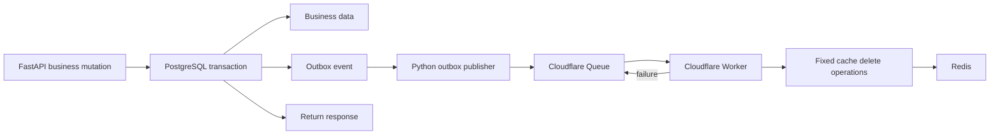

# Cloudflare Queue Cache Invalidation

## Overview

Move meal-derived cache invalidation from process-local background tasks to a
small durable path:

```text
FastAPI transaction → PostgreSQL outbox → Python publisher
→ Cloudflare Queue → Cloudflare Worker → Redis delete operations
```

PostgreSQL remains the source of truth. The API returns after the business row
and outbox event commit; Queue and Redis work happens asynchronously. Cache
invalidation is eventually consistent and must never decide business-request
success.

## Scope decision

- **Keep:** existing `AsyncUnitOfWork`, outbox table/statuses, dispatch engine,
  lease/backoff behavior, canonical cache-key builders, and read-through cache.
- **Add:** one cache-invalidation event contract, transactional event creation,
  a Python Cloudflare Queue publisher, a fixed-operation Worker, Queue retry/DLQ
  handling, and a short operational runbook.
- **Defer:** HMAC event signing, projection-revision table, revision fencing,
  cache-population changes, local-vs-Cloudflare dual routing, and percentage or
  per-user canary logic.
- **Do not do:** publish after the response without a durable event, send meal
  or nutrition payloads, execute arbitrary Redis commands, or make Queue/Redis
  availability block the meal API.

The deferred items are deliberate. They are needed for stronger cache-write
ordering, hostile-producer protection, or gradual rollout—not for a first
invalidation-only path. This v1 accepts a short stale-cache window during rare
concurrent read/write races; later cache-population work can add fencing if that
guarantee becomes a product requirement.

## Progress note

Local contract, transactional outbox, and Python Queue publisher are
implemented in this repository. The Worker consumer and its tests are now
isolated in the sibling `nutreeai_async` repository. External Redis provider
proof plus staging/live deployment evidence are still blocked on credentials
and environment access outside these repos.

## Phases

| Phase | Name | Status |
|-------|------|--------|
| 1 | [Minimal Contract and Provider Proof](./phase-01-contract-and-scope.md) | In progress |
| 2 | [Transactional Outbox Integration](./phase-02-durable-cache-outbox.md) | Completed |
| 3 | [Python Queue Publisher](./phase-03-queue-relay.md) | Completed |
| 4 | [Worker Redis Consumer](./phase-04-worker-redis-consumer.md) | Completed |
| 5 | [Staging and Production Enablement](./phase-05-canary-and-operations.md) | Blocked |

## Architecture



The Worker validates a small versioned event and an allowlist of Redis key
prefixes. It ACKs only after all deletes succeed. Queue delivery remains
at-least-once, so exact-key deletion must be idempotent and pattern deletion
must be bounded and safe to retry.

## Success criteria

- Every migrated meal write commits its business row and one durable cache event
  together, or commits neither.
- API success depends only on PostgreSQL commit. Queue publish failures leave a
  retryable outbox event; after Queue acceptance, Redis failures are owned by
  Queue retry/DLQ and do not fail the request.
- Queue acceptance marks the existing outbox event `COMPLETED`; this means only
  that the Queue accepted the message.
- Worker ACK occurs only after fixed, validated Redis delete operations succeed;
  failures retry and eventually reach the configured DLQ.
- Duplicate and out-of-order invalidation events are harmless for the supported
  delete operations.
- Existing cache population, nutrition calculation, and public API payloads are
  unchanged.
- No secrets, meal payloads, nutrition data, or arbitrary Redis commands are in
  the event contract.
- Local, CI, staging, deployment, and live Queue/Worker/Redis evidence remain
  separately reported.

## Research and verification inputs

- [Local outbox/cache scout](./research/local-outbox-cache-scout.md)
- [Cloudflare Queue platform research](./research/cloudflare-queue-platform-research.md)
- [Existing team proposal](../../docs/decisions/260822-1631-cloudflare-async-cache-worker-proposal.md)
- [Earlier security review](./reports/from-code-reviewer-to-planner-red-team-security-adversary-plan-review-report.md)

## Validation log

- **2026-08-22 — local scout:** verified existing outbox, UoW, cache-key, and
  post-commit invalidation paths.
- **2026-08-22 — platform research:** verified Queue HTTP publishing,
  per-message ACK/retry, DLQ behavior, Worker runtime constraints, and Redis
  HTTP-provider feasibility as the external gate.
- **2026-08-22 — scope review:** user approved deferring HMAC, projection
  revisions/fencing, cache-writer changes, dual routing, and complex canaries.
- **2026-08-22 — implementation diff:** local contract, outbox, publisher,
  Worker, and test coverage are present in the working tree.
- **2026-08-22 — rollout blocker:** staging/live deployment and provider
  credential proof remain blocked outside the repo.
- **2026-08-22 — final review fixes:** Worker namespace isolation, revision
  sidecar deletion, retry classification, UUID validation, and Queue-disabled
  compatibility handling are covered locally; rollback stale-cache behavior is
  documented as an accepted maintenance-window trade-off.
- **Final plan gate:** `ck plan validate --strict` must pass before cooking.

## Unresolved questions

- Which deployed Redis provider exposes the HTTP operations required by the
  Worker, including bounded pattern deletion?
- Which staging/production Queue names, credentials, and deployment owner apply?
