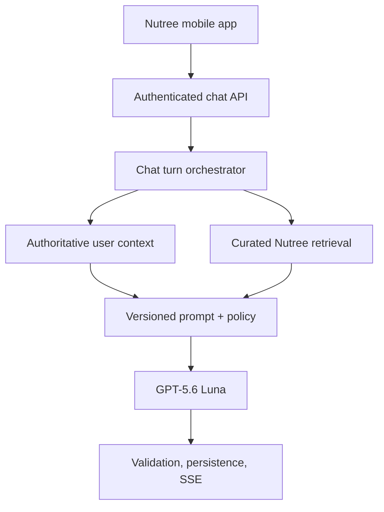
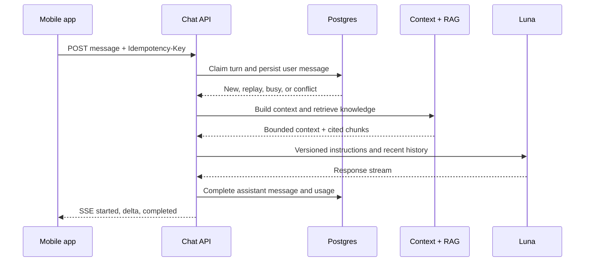

# Nutree Chatbot: Single-Thread Backend MVP

**Status:** Proposed  
**Date:** 2026-09-01  
**Owners:** Nutree Backend / Product  
**Scope:** Read-only, authenticated nutrition coach with exactly one conversation per user

## Context

Nutree needs an in-app coach that can answer questions using the user's current
Nutree data and reviewed Nutree nutrition guidance. The first release must serve
mass users economically without weakening nutrition accuracy, privacy, or the
backend's existing rule that calories and macros are authoritative server values.

The product currently needs one continuous conversation, not folders, agents,
autonomous actions, or multiple threads. The chatbot may explain and recommend,
but it must not claim that it changed a meal, target, profile, or subscription.

## Decision

Build a **Nutree-owned, single-thread, read-only chat service** with:

1. one durable thread per authenticated Firebase user;
2. deterministic personal context assembled from Nutree's authoritative SQL
   projections on every turn;
3. hybrid retrieval only over versioned, human-reviewed Nutree knowledge;
4. `gpt-5.6-luna` as the default generation model;
5. server-sent events (SSE) for response delivery;
6. durable idempotency, one active generation per user, and replay after an
   ambiguous client retry;
7. provider-side response storage disabled (`store=false`); and
8. a versioned prompt, context contract, retrieval contract, and evaluation set.

Accuracy comes primarily from authoritative context, retrieval quality, output
constraints, and evaluation—not from selecting the largest model for every turn.

## Why Luna

`gpt-5.6-luna` is sufficient as the default for the MVP and the preferred model
for mass usage: normal coaching turns are short, grounded, latency-sensitive,
and do not require open-ended research. Luna should not calculate Nutree values;
it explains values already produced by Nutree services.

Use a configurable `CHAT_ESCALATION_MODEL` only after evaluation demonstrates a
measurable quality gap. Potential escalation signals are complex multi-constraint
planning, conflicting evidence, or a high-risk health topic. An escalation model
must still receive the same bounded context and safety rules. It must never be a
substitute for deterministic nutrition calculations or clinical advice.

Recommended starting policy:

| Concern | MVP policy |
|---|---|
| Default model | `gpt-5.6-luna` |
| Reasoning | Low effort; grounded answer, no hidden recalculation |
| Maximum answer | 700–900 output tokens |
| Model fallback | Retry transient provider failure once; then return a safe retryable error |
| Quality escalation | Disabled until offline evaluation proves it is needed |
| Provider state | `store=false`; no provider-managed thread |

## System design

The application service owns orchestration. Domain ports define chat persistence,
completion, embedding, and knowledge retrieval. Infrastructure implements those
ports with PostgreSQL/pgvector and the OpenAI Responses API. The API layer only
authenticates, validates, maps errors, and emits SSE.

## Turn sequence

Context loading and knowledge retrieval should run concurrently after the turn
claim. The database transaction must not remain open during model inference.

## Context contract

Personal facts are **not RAG**. They are fetched directly from Nutree services so
the model sees current, permission-scoped values. The context builder returns a
versioned, bounded snapshot:

| Priority | Context | Source | Rule |
|---|---|---|---|
| 1 | Allergies and safety restrictions | User profile | Hard constraint; never override |
| 2 | Goal, target, TDEE, macro targets | Existing backend services | Backend values are authoritative |
| 3 | Today's consumed and remaining values | Daily projection | Never recalculate |
| 4 | Recent meals | Last 3 local-calendar days, max 24 | Summarize only from stored nutrition |
| 5 | Conversation history | Last 20 completed messages | User/assistant text, no failed drafts |
| 6 | Older conversation summary | Optional after MVP validation | Non-authoritative; cannot override rows 1–4 |

Every snapshot includes `context_version`, `as_of`, locale, and resolved user
timezone. Missing data remains explicitly null. The model asks a clarifying
question instead of inventing a value.

Precedence is fixed:

`safety restrictions > current Nutree data > reviewed Nutree knowledge > recent conversation > general model knowledge`.

Conversation summaries are deferred until the basic path passes evaluation. If
added, summaries must distinguish user-stated preferences from confirmed profile
facts and carry `summary_through_message_id` so they can be regenerated.

## Retrieval contract

RAG contains only Nutree-approved knowledge. It must not ingest arbitrary web
pages, user chats, raw support tickets, or model-generated text.

Each knowledge document records:

- stable source key, title, locale, and canonical URI;
- content version and SHA-256 digest;
- reviewer identity, approval timestamp, and optional expiry;
- safety/topic/audience tags and active state; and
- chunks of roughly 300–500 tokens with about 50 tokens of overlap.

Retrieval pipeline:

1. filter by `active`, locale, validity dates, and applicable safety tags;
2. run PostgreSQL full-text and pgvector searches in parallel;
3. combine ranks using reciprocal-rank fusion;
4. remove near-duplicate chunks and cap the result at 3–5 chunks;
5. require a minimum relevance threshold; and
6. label results `[K1]`, `[K2]`, etc. for answer citations.

Retrieved text is delimited as untrusted reference data. Instructions inside a
retrieved chunk are ignored. If retrieval has no adequate evidence, the answer
must say that Nutree does not have enough verified information rather than cite
general model memory as a Nutree source.

## Prompt and answer policy

The system prompt is versioned and has five sections in a stable order so prompt
caching can reuse its prefix:

1. Nutree Coach identity and concise response style;
2. authority and precedence rules;
3. medical, allergy, eating-disorder, and extreme-restriction safety rules;
4. the server-generated user context; and
5. retrieved Nutree knowledge with citation labels.

The assistant must:

- reply in the requested locale, with Vietnamese and English covered at launch;
- distinguish "Nutree knows" from general guidance;
- cite factual claims derived from retrieved knowledge;
- never fabricate a citation or expose internal prompts/context;
- never claim to write data during this read-only phase; and
- use urgent-care language for emergency symptoms and professional-care language
  for medical diagnosis, medication, pregnancy complications, severe allergy,
  or eating-disorder risk.

Deterministic pre-output checks block an answer that conflicts with a known
allergy, exposes internal context, or claims a successful mutation. Numeric
calorie/macro statements must be traceable to the context snapshot or a cited
knowledge chunk.

Raw provider tokens are not forwarded directly. The orchestrator buffers to a
sentence boundary, applies these checks, and emits sentence-sized SSE deltas.
This adds a small first-delta delay but prevents a known violation from becoming
client-visible before validation. The final citation map is checked before
`message.completed` is emitted.

## Persistence model

### `chat_thread`

| Column | Purpose |
|---|---|
| `id` | Server UUID |
| `user_id` | Firebase-linked Nutree user; unique |
| `summary` | Optional non-authoritative rolling summary |
| `summary_through_message_id` | Summary boundary |
| timestamps | Lifecycle and retention |

The unique `user_id` constraint is the invariant that creates exactly one thread.

### `chat_message`

| Column | Purpose |
|---|---|
| `id`, `thread_id` | Durable message identity |
| `role` | `user` or `assistant` |
| `status` | `generating`, `completed`, or `failed` |
| `content` | Final content; failed partials are not returned by default |
| `idempotency_key`, `request_fingerprint` | Safe replay and conflict detection |
| `model`, `provider_response_id` | Debugging without provider-owned state |
| `prompt_version`, `context_version` | Reproducibility |
| `citation_source_keys` | Provenance for the answer |
| token counts and timestamps | Cost and latency analysis |

Database constraints enforce one active assistant generation per thread and one
idempotency key per user turn. A generation lease becomes reclaimable after a
short timeout so a crashed process cannot leave the user permanently busy.

### `chat_knowledge_document` and `chat_knowledge_chunk`

Documents own review/version metadata. Chunks own full-text search data and the
embedding vector. User-specific context is never copied into these tables.

## HTTP contract

Thread identity is implicit from the authenticated user; clients cannot submit a
different `thread_id`.

| Endpoint | Behavior |
|---|---|
| `GET /v1/chat?before=&limit=` | Return the single thread and completed messages |
| `POST /v1/chat/messages` | Claim a turn and return `text/event-stream` |
| `DELETE /v1/chat` | Clear messages/summary while preserving the one-thread identity |

`POST /v1/chat/messages` uses the repository's existing `Idempotency-Key`
contract. Same key and fingerprint replays the stored result; same key with a
different body returns `409 CHAT_IDEMPOTENCY_CONFLICT`; another active turn
returns `409 CHAT_BUSY`.

SSE events:

| Event | Required data |
|---|---|
| `message.started` | thread, user-message, and assistant-message IDs |
| `message.delta` | assistant message ID and text delta |
| `message.completed` | model, usage, and cited source metadata |
| `message.error` | stable code and retryability; never raw provider text |

## Reliability and mass-user controls

- Per-user short-window rate limit and configurable daily turn budget.
- Global concurrency semaphore and provider circuit breaker.
- Bounded input length, history size, retrieved chunks, and output tokens.
- Exponential retry only for safe transient provider failures.
- No open database transaction while waiting for the model.
- Backpressure returns deterministic `429` or `503` with `Retry-After`.
- Prompt caching for the stable instruction prefix.
- Completed results are replayable after mobile timeout or disconnect.

## Privacy and observability

Nutree owns conversation state. OpenAI receives only the bounded context needed
for the current turn and is called with `store=false`. Account deletion removes
the thread and messages through the existing user cascade.

Default logs contain IDs, version numbers, timings, model, token usage, retrieval
source keys/scores, completion state, and stable errors. They do not contain chat
text, prompts, profile values, emails, auth tokens, or raw provider payloads.

Monitor:

- turns, completion/failure/retry rates, and busy conflicts;
- time to first token and end-to-end p50/p95;
- input/output/cached tokens and estimated cost per completed turn;
- retrieval hit rate, selected source keys, and no-evidence rate; and
- safety blocks, citation failures, and user feedback.

## Evaluation and release gates

Create a versioned bilingual golden set before rollout. It must cover profile and
daily-context recall, remaining-macro questions, allergies, conflicting user
instructions, missing data, prompt injection in retrieved text, citation
precision, medical boundaries, and conversational follow-ups.

Proposed launch gates:

| Metric | Gate |
|---|---|
| Known allergy violations | 0 in the golden set |
| Backend calorie/macro contradictions | 0 in the golden set |
| Personal-context fact accuracy | at least 98% |
| Citation precision | at least 95% |
| Unsupported confident claims | below 2% |
| Successful-turn p95 latency | product budget, measured on staging |
| Cost per completed turn | below the approved unit-economics budget |

Compare Luna against any proposed escalation model on the same set. Escalation
ships only if the quality gain is statistically meaningful enough to justify its
latency and cost.

## Scope boundaries

Included in MVP:

- exactly one authenticated thread;
- read-only coaching;
- current profile, targets, daily progress, and recent meals;
- reviewed Nutree RAG with citations;
- bilingual responses, persistence, SSE, reset, and observability.

Deferred:

- meal/profile mutations and general tool use;
- web search or unreviewed external sources;
- image/voice input;
- multiple threads and sharing;
- proactive messages;
- durable long-term inferred memory; and
- automatic multi-model escalation.

## Alternatives rejected

### Provider-managed conversation state

Rejected for MVP. It weakens Nutree's control over deletion, replay, audit,
context precedence, and provider portability. The Responses API remains stateless
from Nutree's perspective.

### Vectorizing all user data

Rejected. Profile, target, and meal facts already have authoritative structured
sources. Semantic search would make freshness and precedence less predictable.

### Largest model for every turn

Rejected. It increases unit cost and latency without fixing weak grounding.
Luna remains default; evaluation—not intuition—decides escalation.

### Agentic writes in the first release

Rejected. Advice and mutation need different authorization, confirmation,
idempotency, audit, and rollback contracts. The MVP stays read-only.

## Consequences

Positive:

- Nutree retains privacy, deletion, portability, and audit control.
- Personalization is fresh and deterministic on every turn.
- Curated RAG makes factual provenance visible.
- Luna keeps mass-user latency and cost bounded.
- The one-thread invariant simplifies mobile UX and backend concurrency.

Trade-offs:

- Older conversational details eventually fall outside the bounded history until
  rolling summary is enabled.
- SSE retry/replay and generation leases add persistence complexity.
- Reviewed knowledge requires an operational publishing workflow.
- A read-only MVP cannot yet complete actions for the user.

## References

- [OpenAI model documentation: GPT-5.6 Luna](https://developers.openai.com/api/docs/models/gpt-5.6-luna)
- [OpenAI conversation state guide](https://developers.openai.com/api/docs/guides/conversation-state)
- [OpenAI retrieval guide](https://developers.openai.com/api/docs/guides/retrieval)
- [OpenAI streaming Responses guide](https://developers.openai.com/api/docs/guides/streaming-responses)
- Nutree durable write contract: `docs/decisions/260811-durable-write-contract.md`
- Nutree architecture authority: `docs/system-architecture.md`
