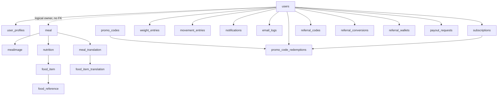

# Database Model Architecture Review

## Summary

The backend schema is usable for the next 6-12 months, but it has grown feature-by-feature. The main risk is not one bad table. The risk is uneven data ownership and partial denormalization: some user-owned records use real foreign keys and normalized child tables, while others store ownership or business data as plain strings/JSON. That makes account deletion, data integrity, analytics, and migrations harder as volume grows.

Recommended direction: do not rewrite the schema in one blast, but normalization is a non-negotiable target. Stabilize the foundation in phases:

1. Fix model discovery and documentation drift.
2. Add missing ownership constraints where safe.
3. Normalize source-of-truth data currently stored as JSON or overloaded table semantics.
4. Build read models/materialized summaries only after normalized write models are stable.

## Normalization Standard

Architectural rule: OLTP source-of-truth tables should follow 3NF unless there is an explicit, documented exception.

Allowed exceptions:

- Raw external provider payload snapshots for audit/debugging.
- Short-lived cache/read-model payloads that can be rebuilt from normalized tables.
- Append-only context payloads where querying individual fields is not a product or ops requirement.

Not allowed as long-term source of truth:

- User preferences stored only as JSON arrays.
- Recipe steps/ingredients stored only as JSON.
- Saved suggestions stored only as opaque JSON.
- Notification recipient/token data stored only inside `context`.
- Payment/payout details stored only as JSON if fields drive workflow, audit, or support.

Migration rule: normalize incrementally. Do not create a risky all-at-once migration; add normalized tables, dual-write/backfill, cut reads over, then retire old JSON fields.

## Reviewed Scope

- ORM models under `src/infra/database/models/`
- Alembic migrations under `migrations/versions/`
- Database config and UoW/session patterns under `src/infra/database/`
- Repository/query usage patterns where they reveal relationship or scale concerns

Out of scope:

- Live database/data inspection
- New code or migration implementation
- Product redesign
- External warehouse/BI design beyond schema readiness recommendations

## Current Database Platform

Runtime code points to PostgreSQL/Neon:

- `src/infra/database/config.py` normalizes `postgres://` and `postgresql://` into `postgresql+psycopg2://`.
- `src/infra/database/config_async.py` normalizes async URLs into `postgresql+asyncpg://`.
- Migrations use Postgres-only features: partial indexes, `postgresql_using`, `JSONB`, `pgvector`, `ON CONFLICT`.

Docs are inconsistent:

- `docs/database-guide.md` says PostgreSQL/Neon.
- `docs/architecture/infrastructure.md` still says MySQL 8.0.
- Some comments in test DB helpers still mention MySQL.

Architectural decision: treat PostgreSQL/Neon as canonical. Update stale MySQL docs before making more DB decisions.

## Model Inventory

| Area | Tables/models | Purpose | Relationship quality |
|---|---|---|---|
| Identity | `users` | Firebase/auth identity, language, timezone, soft delete | Root aggregate |
| Profile | `user_profiles` | Health, goals, onboarding preferences, water goal | FK to `users`; JSON preference arrays should be normalized |
| Subscription | `subscriptions` | RevenueCat cache | FK to `users`; indexed by status/expiry/subscriber |
| Meals | `meal`, `mealimage` | Meal lifecycle, image metadata, recipe-ish fields, hydration logs | `meal.image_id` FK; `meal.user_id` lacks FK; recipe/hydration fields need normalization |
| Nutrition | `nutrition`, `food_item` | Meal macros and ingredients | `nutrition.meal_id` FK; `food_item.nutrition_id` nullable FK |
| Translation | `meal_translation`, `food_item_translation` | Localized meal/food content | `meal_translation.meal_id` nullable FK; food item translation has no FK to `food_item` |
| Food catalog | `food_reference` | Canonical per-100g reference data | Standalone catalog; `food_item.food_reference_id` FK |
| Saved suggestions | `saved_suggestions` | Bookmarked/generated suggestions stored as JSON | No FK to `users`; user id width differs; `suggestion_data` should become normalized children |
| Weekly budgets | `weekly_macro_budgets` | Weekly macro targets and consumed totals | No FK to `users`; unique `(user_id, week_start_date)` |
| Cheat days | `cheat_days` | One cheat marker per user/date | No FK to `users`; unique `(user_id, date)` |
| Weight | `weight_entries` | User weight history | FK to `users`; unique `(user_id, recorded_at)` |
| Movement | `movement_entries` | User movement/calorie burn logs | FK to `users`; indexed by `(user_id, logged_at)` |
| Notifications | `notifications` | Scheduled notification queue | FK to `users`; dedup unique constraint; `context` JSON should not own recipient/token truth |
| Notification prefs | `notification_preferences` | Per-user notification toggles/times | No FK to `users`; unique user id |
| FCM tokens | `user_fcm_tokens` | Push tokens by user/device type | No FK to `users`; unique token |
| Email | `email_logs` | Lifecycle/welcome email sends | FK to `users` |
| Promo | `promo_codes`, `promo_code_redemptions` | Email promo code flow | Redemptions FK to promo/user/subscription |
| Referral | `referral_codes`, `referral_conversions`, `referral_wallets`, `payout_requests` | Affiliate/referral accounting | FKs exist, but no cascade policy; money/status/payment details need stronger normalized invariants |
| Feature flags | `feature_flags` | Simple runtime toggles | Standalone |
| Image cache | `meal_image_cache`, `pending_meal_image_resolution` | pgvector image cache and pending resolution queue | Migrations/models exist, but central model registry misses them |

## Relationship Map

Dashed relationship means the app treats it as owned by user, but the database does not enforce it.

## Major Findings

### 1. Source-of-truth data is not fully normalized

Several fields contain business entities as JSON or overloaded columns:

- `user_profiles.dietary_preferences`, `health_conditions`, `allergies`, `pain_points`, `referral_sources`, `training_types`
- `meal.instructions`
- `food_reference.serving_sizes`, `extra_nutrients`
- `saved_suggestions.suggestion_data`
- `notifications.context`
- `payout_requests.payment_details`
- Hydration entries represented as `meal` rows

Impact:

- Constraints cannot protect individual values.
- Product analytics and support queries become JSON parsing work.
- Backfills are fragile because nested shapes drift over time.
- Multiple domains depend on hidden payload contracts instead of explicit relationships.

Recommendation:

- Normalize source-of-truth fields into child/reference tables.
- Keep JSON only as optional raw provider snapshots or rebuildable read/cache payloads.
- Use phased dual-write/backfill/cutover for high-risk tables.

### 2. User ownership is inconsistent

Some important user-owned tables lack `ForeignKey("users.id")`:

- `meal.user_id`
- `weekly_macro_budgets.user_id`
- `cheat_days.user_id`
- `saved_suggestions.user_id`
- `notification_preferences.user_id`
- `user_fcm_tokens.user_id`

Impact:

- Account deletion can leave orphaned rows unless every cleanup path is perfect.
- Backfills and data repair become harder.
- Analytics queries need defensive joins.
- Future partitioning/retention rules become messy.

Recommendation:

- Add missing FKs gradually, starting with tables that already use canonical `String(36)` ids.
- For `saved_suggestions.user_id`, first resolve why it is `String(128)` while `users.id` is `String(36)`.

### 3. Alembic model discovery can miss tables

`migrations/env.py` sets `target_metadata = Base.metadata`, but does not import the full model registry before using metadata. Separately, `src/infra/database/models/__init__.py` does not import:

- `MealImageCacheModel`
- `PendingMealImageResolutionModel`

Impact:

- Alembic autogenerate can produce false diffs or miss tables.
- First-deployment `Base.metadata.create_all()` paths can omit migrated tables.
- Tests that rely on central model imports may not match production migrations.

Recommendation:

- Make a single explicit model registry module and import every ORM model there.
- Import that registry in Alembic `env.py` before `target_metadata` is read.
- Add a small test that asserts expected tables are in `Base.metadata.tables`.

### 4. `meal` is doing too much

`meal` currently represents:

- AI-scanned meals
- Manual meals
- AI suggestion saves
- Hydration entries
- Caloric drink entries
- Recipe-ish metadata

Hydration commands create `meal` rows with `meal_type="hydration"` and placeholder `MealImage`. This was pragmatic, but it weakens the aggregate boundary.

Impact:

- Meal queries need special cases for hydration.
- Image is required even when the concept has no image.
- Future Apple Health hydration sync or drink analytics will be awkward.
- Nutrition totals can accidentally include/exclude activity-like entries if filters drift.

Recommendation:

- Add dedicated `hydration_entries`; do not leave hydration as a permanent meal subtype.
- Keep `meal` for food meals.
- Keep `movement_entries` separate as it already is.
- Backfill gradually and keep API responses compatible during cutover.

### 5. Read model pressure is increasing

Daily macros, hydration, movement, weekly budget, bulk nutrition, and activities all compute cross-context summaries at request time.

Current pattern is okay now because:

- Queries are mostly bounded by user/date.
- There are useful indexes like `(user_id, logged_at)` on movement.
- Redis cache-aside is already used selectively.

Scale risk:

- As the activity feed grows, the same day/range summaries will be recalculated often.
- Hydration stored in `meal` makes summary filters heavier.
- Weekly budget consumed fields can drift from actual meal/movement state unless there is one clear update path.

Recommendation:

- Keep request-time computation for now.
- After ownership/FKs and normalization are fixed, introduce a `daily_user_nutrition_summary` read model only for hot paths.
- Rebuild read models from source-of-truth tables, not the other way around.

### 6. Sync and async DB paths coexist

The codebase has both sync `UnitOfWork` and async `AsyncUnitOfWork`. Some repositories explicitly commit internally, while async repositories mostly avoid commits and leave transaction ownership to UoW.

Examples:

- `AsyncMealRepository`, `AsyncNotificationRepository`, `ReferralRepository` are non-committing.
- `PgvectorMealImageCacheRepository` is sync work in async methods and commits directly.
- Legacy sync repositories still commit internally in places.

Impact:

- Transaction boundaries are harder to reason about.
- Request latency can suffer if sync DB work runs on async request paths.
- Error handling differs by repository family.

Recommendation:

- For request-path DB work, standardize on `AsyncUnitOfWork`.
- Keep sync UoW for cron jobs if simpler, but document it as cron-only.
- Move pgvector cache access to async DB or isolate it behind a worker/thread boundary if it becomes hot.

### 7. Money/accounting models need stronger invariants

Referral and payout models are directionally solid, with row locks used in repository code for wallet/conversion updates. But money fields currently mix `Float`, integer VND, and status strings.

Impact:

- Float money can create rounding/audit problems.
- Status strings lack DB-level validation.
- Payout details JSON can become unqueryable and risky if it grows.

Recommendation:

- Use integer minor units for all internal money accounting.
- Keep original currency/amount as explicit fields if needed.
- Add status check constraints or enums for referral/payout state.
- Treat payout payment details as sensitive; document retention and access.

## Recommended Phased Roadmap

### Phase 0 - Make DB Truth Explicit

Priority: highest

Scope:

- Update docs to say PostgreSQL/Neon is canonical.
- Remove or correct stale MySQL/table-count references.
- Add a current schema inventory doc generated from ORM/migrations.
- Decide whether `Base.metadata.create_all()` first-deployment path is still allowed in production. Prefer Alembic-only.

Success criteria:

- Docs agree on DB engine.
- New engineers can answer "what tables exist and who owns them" from one doc.
- Alembic scripts have one current head, currently `20260531000001`.

### Phase 1 - Fix Model Registry and Migration Safety

Priority: highest

Scope:

- Ensure all ORM models are imported by central registry.
- Import registry in Alembic `env.py`.
- Add metadata coverage test for expected tables.
- Add migration smoke check in CI: `alembic heads` must return exactly one head.

Success criteria:

- `Base.metadata.tables` includes `meal_image_cache` and `pending_meal_image_resolution`.
- Alembic autogenerate sees the full model set.
- No multiple-head migration regressions.

### Phase 2 - Enforce User Ownership

Priority: high

Scope:

- Add FKs for user-owned tables that already use canonical user ids.
- Backfill/clean orphan rows before constraints.
- Add deliberate cascade or restrict behavior per table.

Suggested order:

1. `notification_preferences.user_id -> users.id`
2. `user_fcm_tokens.user_id -> users.id`
3. `weekly_macro_budgets.user_id -> users.id`
4. `cheat_days.user_id -> users.id`
5. `meal.user_id -> users.id`
6. `saved_suggestions.user_id -> users.id` only after id width/source is resolved

Cascade guidance:

- Cascade on private user-owned logs/preferences: FCM tokens, notification prefs, weight, movement, cheat days, weekly budgets.
- Be careful with revenue/referral/accounting data. Prefer anonymization or restrict/delete policy based on business/legal retention.

### Phase 3 - Normalize Source-of-Truth Structures

Priority: high

Scope:

- Add normalized child/reference tables for business data currently stored as JSON.
- Use dual-write/backfill/cutover for production safety.
- Keep raw JSON columns temporarily as audit/provider snapshots, then retire them when reads are migrated.

Suggested order:

1. User profile preferences:
   - `user_dietary_preferences`
   - `user_health_conditions`
   - `user_allergies`
   - `user_pain_points`
   - `user_training_types`
   - `user_referral_sources`
2. Hydration:
   - `hydration_entries`
   - optional `drink_catalog` if the backend catalog needs runtime updates
3. Saved suggestions:
   - `saved_suggestion_items`
   - `saved_suggestion_steps`
   - explicit macro fields on `saved_suggestions`
4. Food reference details:
   - `food_reference_serving_sizes`
   - `food_reference_nutrients`
5. Notification schedule context:
   - keep `notifications.context` only for immutable render snapshot
   - keep recipient/token truth in `user_fcm_tokens` and/or normalized notification recipient rows if needed
6. Payout/payment support:
   - explicit payout account fields or encrypted normalized payment detail records
   - do not depend on opaque JSON for workflow state

Success criteria:

- Core product state can be queried and constrained without JSON parsing.
- JSON fields that remain are explicitly labeled as raw snapshot, audit, cache, or temporary compatibility fields.
- API compatibility is preserved through mappers.

### Phase 4 - Stabilize Hot Query Indexes

Priority: high

Scope:

- Add compound indexes based on final or near-final normalized query filters.
- Avoid broad single-column indexes that duplicate compound coverage.
- Prefer Postgres partial indexes for hot status filters.

Likely candidates:

- `meal(user_id, created_at)` and possibly partial for active/ready meals.
- `hydration_entries(user_id, logged_at)` after hydration split.
- `notifications(status, scheduled_for_utc)` or keep current partial index but verify order with `EXPLAIN`.
- `user_fcm_tokens(user_id, is_active)` for send path.
- `weekly_macro_budgets(user_id, week_start_date)` already covered.
- `movement_entries(user_id, logged_at)` already exists.

Success criteria:

- Daily macros, daily activities, hydration, notification dispatch, and bulk nutrition have predictable indexed access paths.
- Index names and model definitions match migrations.

### Phase 5 - Add Read Models for Daily Summaries

Priority: medium

Scope:

- Add `daily_user_nutrition_summaries` or similar read model.
- Source from normalized meals, hydration, movement.
- Update via write-side invalidation/event handlers or rebuild job.
- Keep source tables authoritative.

Do not start here. If source ownership and normalized semantics are not stable, read models amplify drift.

### Phase 6 - Accounting Hardening

Priority: medium

Scope:

- Normalize money to integer minor units.
- Add status constraints.
- Add audit trail for wallet changes and payout transitions.
- Decide deletion/anonymization policy for referral/accounting records.

## Non-Recommendations

Do not:

- Split into microservices now. The schema does not need service boundaries yet.
- Normalize everything in one all-at-once migration. Normalize source-of-truth data incrementally with compatibility windows.
- Keep JSON as the permanent owner of business entities, preferences, workflow state, or queryable product data.
- Build an event-sourced ledger for all nutrition immediately. Too much ceremony for current needs.
- Add warehouse/OLAP before OLTP ownership is clean.
- Replace SQLAlchemy because of current schema drift. The issue is modeling discipline, not the ORM.

## Acceptance Criteria for This Review

- Current model/table inventory documented.
- Current relationships and missing relationships called out.
- Normalization is established as a non-negotiable target for OLTP source-of-truth data.
- Scale risks prioritized for 6-12 month horizon.
- Refactor roadmap avoids a rewrite and preserves product velocity.
- No code or migration changes made.

## Unresolved Questions

- Is `saved_suggestions.user_id` intended to store `users.id`, Firebase UID, or another external id?
- Should account deletion physically cascade all user nutrition/history rows, or retain anonymized analytics/accounting records?
- Which normalized area should go first after ownership cleanup: profile preferences, hydration, or saved suggestions?
- Are first-deployment `Base.metadata.create_all()` paths still used in production, or can production become Alembic-only?
