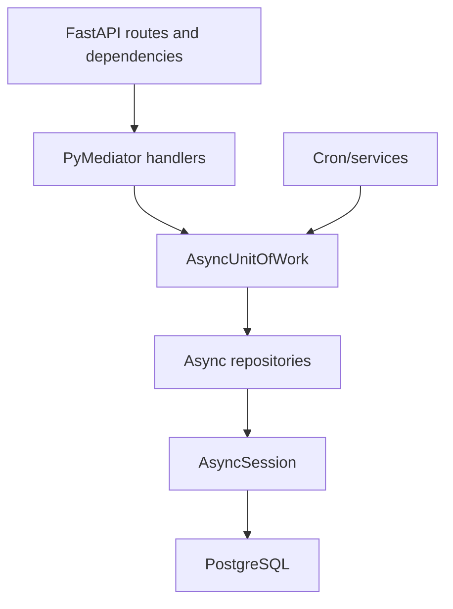

# Async Repository Consolidation Brainstorm

## Summary

MealTrack backend should consolidate to an async-only database runtime. The approved direction is phased migration, not a big-bang rewrite.

End-state:

- Runtime DB access uses async SQLAlchemy sessions and `AsyncUnitOfWork`.
- Repository ports are async-shaped.
- Repositories never call `commit()` internally.
- FastAPI request paths, event handlers, cron jobs, health checks, food reference lookups, pgvector cache, pending image queue, and translation persistence all use async DB access.
- Sync `UnitOfWork`, sync DB config usage, sync repositories, and async wrappers around sync repositories are removed.

## Codebase Findings

The repo is FastAPI/Python 3.11+, SQLAlchemy 2.0, PostgreSQL/Neon, Redis, and PyMediator CQRS.

Docs already define the target direction:

- Request-path DB work should use `AsyncUnitOfWork` and async repositories.
- Repositories inside `AsyncUnitOfWork` must not call `commit()`.
- Sync UoW/repositories are acceptable only for cron or isolated scripts today.

Current drift:

- `AsyncUnitOfWork` is the modern path for most handlers.
- Legacy `UnitOfWork` and sync repositories still exist.
- Several sync repositories commit internally.
- `MealRepositoryPort` is sync-shaped, while `AsyncMealRepository` implements async methods under that same contract.
- Tests contain wrappers that make sync repositories awaitable, masking the contract mismatch.
- Sync request dependencies still exist in `src/api/base_dependencies.py`.

Hot spots included in scope:

- `src/infra/repositories/food_reference_repository.py`
- `src/infra/repositories/pgvector_meal_image_cache_repository.py`
- `src/infra/repositories/pending_meal_image_repository.py`
- `src/infra/repositories/meal_translation_repository.py`
- `src/infra/database/uow.py`
- `src/infra/database/config.py`
- legacy sync repository files and tests

## Requirements

Expected output:

- A design and follow-on implementation plan for full async repository consolidation.

Acceptance criteria:

- No sync DB work remains in FastAPI request paths.
- No repository commits or rolls back internally except session dependency cleanup.
- All repository ports used by application code are async-shaped.
- All cron, service, route, and test paths use async DB access.
- Sync `UnitOfWork`, sync repositories, and sync DB config usage are removed or proven unused and deleted.
- Existing API behavior remains backward compatible.
- Tests, lint, and import-boundary checks pass.

Scope boundary:

- Included: all DB repositories, UoW, DB dependencies, cron/service DB access, health checks, test fixtures, docs.
- Out of scope: schema redesign, new product features, API response changes, read-model creation, non-DB cache redesign beyond making DB-backed cache repositories async.

Non-negotiables:

- Preserve Clean Architecture + CQRS boundaries.
- Backend remains calorie source of truth.
- Keep ORM-to-domain/API mapping explicit.
- Use PostgreSQL/SQLAlchemy async stack already in repo.
- No sync DB runtime remains as a supported backend path.

## Approaches Evaluated

### Approach A - Big Bang Rewrite

Rewrite every port, repo, UoW, route dependency, cron job, and test in one implementation pass.

Pros:

- Fastest to describe.
- Avoids temporary compatibility state.

Cons:

- Very high regression risk.
- Hard to bisect failures.
- Touches too many behavior surfaces at once.
- Likely to break tests for reasons unrelated to product behavior.

Decision: rejected.

### Approach B - Phased Async-Only Consolidation

Move the whole backend toward async-only in verifiable phases. Delete sync pieces only after their consumers are migrated.

Pros:

- Keeps each phase testable.
- Lets risky repositories move behind targeted tests.
- Preserves behavior while removing transaction-boundary drift.
- Aligns with existing docs and modern handlers.

Cons:

- Requires temporary compatibility work.
- More planning overhead.
- Some tests must be rewritten instead of patched.

Decision: approved.

### Approach C - Shared Sync/Async Repository Helpers

Keep both runtimes but extract shared query/filter/mapper helpers.

Pros:

- Smaller first change.
- Some duplication reduction.

Cons:

- Keeps two transaction models alive.
- Encourages clever abstractions around different SQLAlchemy APIs.
- Does not meet async-only requirement.

Decision: rejected.

## Recommended Design

Use Approach B.

Design principles:

- Make async contracts explicit before mass migration.
- Migrate consumers before deleting providers.
- Preserve behavior with repository and handler tests at every phase.
- Share only pure helper logic, such as filters, date-boundary builders, mappers, and projection options.
- Do not create generic sync/async repository base classes.
- Do not keep compatibility wrappers after final cutover.

Target architecture:

## Proposed Phases

### Phase 1 - Contracts and Inventory

- Add async repository port contracts or convert existing ports to async signatures.
- Decide whether old sync port names are renamed or directly converted.
- Inventory all sync DB imports and commit/rollback calls.
- Add guard tests that fail on new sync request-path usage.

Success:

- Contract direction is explicit.
- Static search identifies every migration target.

### Phase 2 - Request Path Migration

- Replace sync route dependencies with async DB dependencies.
- Ensure event bus handlers receive fresh `AsyncUnitOfWork` instances.
- Remove direct sync repository injection from request handlers.
- Fix query handlers that mix async UoW with sync injected repositories.

Success:

- FastAPI request code no longer depends on sync `Session`.
- Manual meal, image upload, meal reads, auth, feature flags, and meal suggestions preserve behavior.

### Phase 3 - Convert Sync-Only Repositories

- Convert food reference repository to async session ownership.
- Convert pgvector meal image cache repository to async SQLAlchemy.
- Convert pending meal image repository to async SQLAlchemy.
- Convert meal translation repository to async session/UoW ownership.
- Keep transaction ownership in UoW or route-level async dependency.

Success:

- No DB-backed repository used by app/runtime code commits internally.
- Cache/pending/translation failures do not poison shared transactions without rollback handling.

### Phase 4 - Cron, Services, and Health Checks

- Convert sync cron/service DB access to `AsyncUnitOfWork`.
- Convert health checks to async engine/session.
- Remove sync `SessionLocal` use from non-migration runtime code.

Success:

- Cron jobs and operational checks run on async DB path.
- Sync DB config has no runtime consumers.

### Phase 5 - Test Fixture Migration

- Remove `AsyncSyncRepoWrapper`.
- Replace sync repository fixtures with async repository fixtures.
- Convert repository tests to async where needed.
- Keep fake repositories async-shaped.

Success:

- Tests exercise real async contracts.
- No tests pass only because sync repos are wrapped into awaitables.

### Phase 6 - Delete Sync Runtime

- Delete `src/infra/database/uow.py`.
- Delete sync repository files after consumers are gone.
- Delete sync DB config if Alembic/migrations do not need it; otherwise isolate migration config from runtime config.
- Remove psycopg2 dependency only if Alembic and any admin scripts are async-ready or explicitly migrated.
- Update docs to say async-only runtime.

Success:

- Static search finds no sync DB runtime imports.
- Tests/lint/mypy/import-linter pass.

## Risks

High risk:

- Repository ports are currently sync-shaped in places. Direct conversion will create broad test breakage.
- Some sync repositories commit internally, so behavior may change when transaction ownership moves to UoW.
- Health checks and scripts may quietly depend on sync config.

Medium risk:

- Alembic may still need a sync engine unless migration setup is separately updated.
- `FoodReferenceRepository` opens sessions internally and may need API/service ownership cleanup.
- Pgvector cache errors have history of poisoning shared transactions; async conversion must keep rollback behavior explicit.

Low risk:

- Pure mapper/filter helper extraction.
- Documentation updates.

Mitigations:

- Convert one repository family at a time.
- Add static guards for banned sync imports before deletion.
- Run targeted tests after every phase.
- Keep API response fixtures/backward-compat tests unchanged.
- Use real async integration tests for pgvector/pending image paths.

## Validation Plan

Static checks:

- `rg "from src.infra.database.config import|SessionLocal|UnitOfWork\\(|commit\\(|rollback\\(" src tests`
- `ruff check src tests`
- `mypy src`
- `lint-imports`

Targeted tests:

- async UoW tests
- meal repository async integration tests
- manual meal command tests
- image upload command tests
- food reference repository tests
- pgvector meal image cache tests
- pending meal image queue tests
- notification/email cron tests
- route tests for meals, suggestions, ingredients, feature flags, health

Full checks:

- `pytest`
- `pytest --cov=src --cov-report=term`

## Recommendation

Proceed to implementation planning with `/ck:plan --tdd`.

Reason:

- This refactor touches critical persistence behavior.
- Existing tests already encode some UoW consolidation intent.
- Tests-first phase design will prevent silent transaction, cache invalidation, and API compatibility regressions.

## Next Steps

1. Create a `/ck:plan --tdd` implementation plan from this report.
2. Start with contract inventory and sync-usage guard tests.
3. Migrate request-path repositories before cron/script cleanup.
4. Delete sync runtime only after static search and tests prove no consumers remain.

## Unresolved Questions

None.
